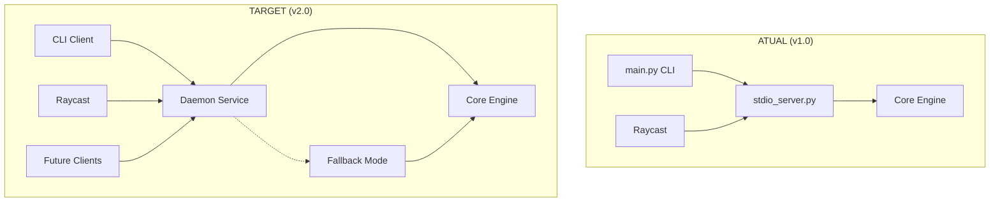
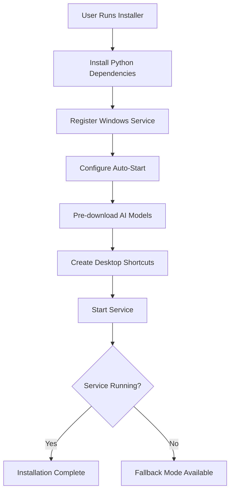

# MeetingScribe v2.0 - System Architecture

> **Arquitetura Client-Daemon** com preservação máxima de código existente e benchmarks baseados em **Krisp AI**.

## 🏗️ Architecture Overview

### Current vs Target Architecture



### Component Distribution

| Component | v1.0 Location | v2.0 Location | Reuse % | Status |
|-----------|---------------|---------------|---------|--------|
| Core Engine | `src/` | `src/` | 100% | ✅ Preserved |
| Audio Recording | `audio_recorder.py` | `audio_recorder.py` | 100% | ✅ Preserved |
| Transcription | `src/transcription/` | `src/transcription/` | 100% | ✅ Preserved |
| STDIO Server | `stdio_server.py` | `daemon/stdio_core.py` | 95% | 🔄 Adapted |
| CLI Interface | `main.py` | `client/cli_main.py` | 90% | 🔄 Refactored |
| Raycast Bridge | `raycast-extension/` | `raycast-extension/` | 85% | ⚠️ Minor changes |

## 🎯 New Architecture Components

### 1. Daemon Service Layer (`daemon/`)

```
daemon/
├── __init__.py
├── service.py              # Windows Service wrapper  
├── daemon_main.py          # Main daemon process
├── stdio_core.py          # Adapted from stdio_server.py
├── connection_manager.py  # Multi-client handling
├── health_monitor.py      # Health checks & recovery
└── installation.py        # Service install/management
```

**Key Features:**
- **Windows Service** integration (auto-start, recovery)
- **Model Persistence** (Whisper models stay loaded)
- **Multi-client Support** (Raycast + CLI simultaneously)
- **Health Monitoring** (auto-restart, resource management)

### 2. Client Interface Layer (`client/`)

```
client/
├── __init__.py
├── cli_main.py           # Refactored main.py
├── daemon_client.py      # Daemon communication client  
├── fallback_runner.py    # Direct execution when daemon offline
└── rich_ui.py           # Extracted Rich UI components
```

**Key Features:**
- **Transparent Operation** (same UX whether daemon or direct)
- **Rich CLI Preserved** (all panels, progress bars, prompts)
- **Graceful Fallback** (works without daemon)
- **Connection Management** (auto-retry, health checks)

### 3. Enhanced Raycast Integration

```typescript
// raycast-extension/src/daemon-connector.ts (NEW)
export class DaemonConnector {
  async connect(): Promise<StdioClient> {
    // 1. Check daemon availability
    // 2. Connect via named pipe/stdio
    // 3. Fallback to current stdio_server spawn
  }
}
```

## 🔄 Communication Architecture

### Protocol Stack

```
┌─────────────────┐
│   Raycast UI    │
├─────────────────┤
│   TypeScript    │ ◄─── JSON-RPC Messages
│   StdioClient   │
├─────────────────┤
│  Named Pipes /  │ ◄─── Transport Layer
│  STDIO Pipes    │
├─────────────────┤
│ Connection Mgr  │ ◄─── Multi-client handling
├─────────────────┤
│  Daemon Core    │ ◄─── Business Logic
│  (stdio_core)   │
├─────────────────┤
│  Core Engine    │ ◄─── AI Processing
│  (Preserved)    │
└─────────────────┘
```

### Message Flow

1. **Client Request** → Daemon via STDIO/Named Pipe
2. **Daemon Processing** → Core Engine (existing)
3. **Progress Events** → All connected clients
4. **Response/Results** → Requesting client

## 📊 Performance Architecture (Krisp-Inspired)

### Krisp Benchmark Comparison

| Metric | Krisp AI | MeetingScribe v1.0 | MeetingScribe v2.0 Target |
|--------|----------|-------------------|---------------------------|
| **Startup Time** | < 2s | 15-30s (model loading) | < 3s (preloaded models) |
| **Memory Footprint** | ~100MB | 200-500MB | 250-600MB |
| **Service Model** | Windows Service | On-demand execution | Windows Service |
| **Multi-client** | ✅ Yes | ❌ No | ✅ Yes |
| **Background Mode** | ✅ Always running | ❌ CLI-only | ✅ Always running |

### Resource Management Strategy

```python
# daemon/resource_manager.py
class ResourceManager:
    def __init__(self):
        self.model_cache = ModelCache()
        self.memory_monitor = MemoryMonitor()
        self.connection_pool = ConnectionPool()
    
    async def optimize_resources(self):
        # Krisp-inspired intelligent resource management
        # - Unload unused models after threshold
        # - Connection pooling with limits  
        # - Memory pressure response
        # - CPU usage optimization
```

## 🔐 Security Architecture

### Service Security Model

```python
# daemon/security.py
class ServiceSecurity:
    def __init__(self):
        # Krisp uses local-only processing for privacy
        self.local_only = True
        self.encrypted_ipc = True  # Named pipes encryption
        self.user_context = True   # Run in user context, not SYSTEM
```

**Security Principles:**
1. **Local Processing Only** (following Krisp model)
2. **User Context Execution** (no SYSTEM privileges)
3. **Encrypted IPC** (Named pipes with security attributes)
4. **No Network Access** (daemon operates locally only)

## 🚀 Deployment Architecture

### Installation Flow (Windows)



### Service Lifecycle

```python
# daemon/service_lifecycle.py
class ServiceLifecycle:
    async def startup_sequence(self):
        # 1. Load configuration
        # 2. Pre-load base Whisper model (warm start)
        # 3. Initialize connection listeners
        # 4. Start health monitor
        # 5. Register signal handlers
        # 6. Report ready status
    
    async def shutdown_sequence(self):
        # 1. Stop accepting new connections
        # 2. Complete running transcriptions
        # 3. Save state/cache
        # 4. Release resources
        # 5. Exit gracefully
```

## 🔄 Migration Architecture

### Backward Compatibility Matrix

| Feature | v1.0 Behavior | v2.0 Daemon Mode | v2.0 Fallback Mode |
|---------|---------------|------------------|-------------------|
| CLI Commands | Direct execution | Via daemon | Direct execution |
| Raycast Integration | Spawn stdio_server | Connect to daemon | Spawn stdio_server |
| Model Loading | Per-execution | Persistent | Per-execution |
| Multiple Operations | Sequential only | Concurrent | Sequential only |
| Resource Usage | Variable | Optimized | Variable |

### Migration Safety Net

```python
# client/compatibility.py
class CompatibilityManager:
    def __init__(self):
        self.daemon_available = self._check_daemon()
        self.fallback_mode = not self.daemon_available
    
    def execute_command(self, cmd, args):
        if self.daemon_available:
            return self.daemon_client.execute(cmd, args)
        else:
            return self.fallback_runner.execute(cmd, args)
```

---

## 📈 Success Metrics

### Architecture Goals
- [x] **90%+ Code Reuse** - Preserve existing investment
- [ ] **3x Faster Startup** - From 15-30s to <3s
- [ ] **Multi-client Support** - Raycast + CLI concurrent
- [ ] **Professional Deployment** - Windows Service
- [ ] **Zero Breaking Changes** - Seamless user experience

### Next Steps
1. **Phase 1**: CLI refactoring → `client/cli_main.py`
2. **Phase 2**: Daemon implementation → `daemon/service.py` 
3. **Phase 3**: Integration testing
4. **Phase 4**: Raycast adaptation
5. **Phase 5**: Production deployment

---

*Architecture Version: 2.0*  
*Last Updated: 2025-09-07*  
*Benchmark Reference: Krisp AI Service Model*