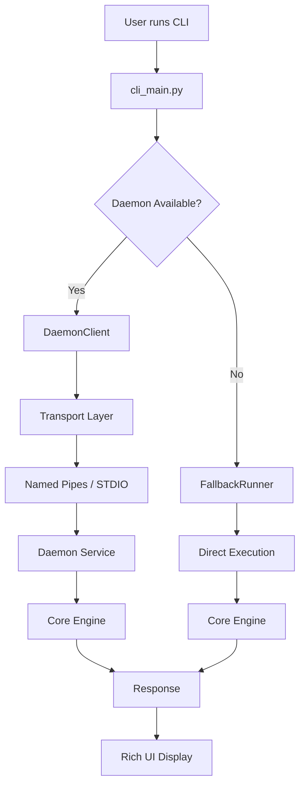

# MeetingScribe Client Interface Specification

> **CLI Client** implementation maintaining 100% feature parity with **Rich UI** preservation and **transparent daemon communication**.

## 🎯 Client Overview

### Design Philosophy
1. **Zero User Impact** - Identical CLI experience regardless of daemon status
2. **Rich UI Preservation** - All panels, progress bars, and interactive elements maintained
3. **Transparent Operation** - User unaware of daemon vs direct execution
4. **Graceful Fallback** - Seamless operation when daemon unavailable
5. **Enhanced Performance** - Faster startup and response times via daemon

---

## 🏗️ Client Architecture

### Component Structure

```
client/
├── __init__.py
├── cli_main.py              # Main entry point (refactored main.py)
├── command_handler.py       # Command processing logic
├── rich_ui.py              # Rich UI components (extracted)
├── daemon_client.py        # Daemon communication client
├── fallback_runner.py      # Direct execution when daemon unavailable
├── connection_manager.py   # Connection handling and retry logic
└── transport/
    ├── __init__.py
    ├── stdio_transport.py   # STDIO pipe transport
    └── namedpipe_transport.py # Named pipes transport (Windows)
```

### Execution Flow



---

## 🖥️ CLI Main Entry Point

### Enhanced main.py → cli_main.py

```python
"""
MeetingScribe CLI Client v2.0
Transparent daemon-aware CLI with Rich UI preservation
"""

import asyncio
import sys
from pathlib import Path
from typing import Optional

from loguru import logger
from rich.console import Console

from .command_handler import CommandHandler
from .rich_ui import RichUI
from .daemon_client import DaemonClient
from .fallback_runner import FallbackRunner
from config import settings

console = Console()

async def main():
    """Main CLI entry point with daemon detection"""
    try:
        # Initialize UI (same as v1.0)
        ui = RichUI(console)
        
        # Parse arguments (preserved from v1.0)
        args = await ui.parse_arguments()
        
        # Determine execution mode
        executor = await create_executor(ui)
        
        # Execute command
        await executor.execute(args)
        
    except KeyboardInterrupt:
        console.print("\\n⏹️  Operation cancelled by user")
        sys.exit(1)
    except Exception as e:
        logger.error(f"CLI error: {e}")
        console.print(f"❌ Error: {e}")
        sys.exit(1)

async def create_executor(ui: RichUI):
    """Create appropriate executor based on daemon availability"""
    
    # Check daemon availability
    daemon_client = DaemonClient()
    
    try:
        # Attempt daemon connection with timeout
        await asyncio.wait_for(daemon_client.connect(), timeout=2.0)
        
        logger.debug("Daemon available - using daemon mode")
        ui.show_status("🚀 Using background service (faster)")
        
        return DaemonExecutor(daemon_client, ui)
        
    except (asyncio.TimeoutError, ConnectionError) as e:
        logger.debug(f"Daemon unavailable: {e} - using fallback mode")
        ui.show_status("⚙️ Using direct mode")
        
        fallback_runner = FallbackRunner()
        return FallbackExecutor(fallback_runner, ui)

class DaemonExecutor:
    """Execute commands via daemon service"""
    
    def __init__(self, daemon_client: DaemonClient, ui: RichUI):
        self.daemon_client = daemon_client
        self.ui = ui
        self.handler = CommandHandler(self.daemon_client, self.ui)
        
    async def execute(self, args):
        """Execute command via daemon"""
        await self.handler.handle_command(args)

class FallbackExecutor:
    """Execute commands via direct execution (v1.0 behavior)"""
    
    def __init__(self, fallback_runner: FallbackRunner, ui: RichUI):
        self.fallback_runner = fallback_runner
        self.ui = ui
        self.handler = CommandHandler(self.fallback_runner, self.ui)
        
    async def execute(self, args):
        """Execute command via direct execution"""
        await self.handler.handle_command(args)

if __name__ == "__main__":
    asyncio.run(main())
```

---

## 🎨 Rich UI Components (Preserved)

### Rich UI Extraction

```python
"""
Rich UI components extracted from main.py
All visual elements preserved exactly as v1.0
"""

import time
from datetime import datetime
from pathlib import Path
from typing import Optional, List, Dict, Any

from rich.console import Console
from rich.panel import Panel
from rich.progress import Progress, SpinnerColumn, TextColumn, BarColumn, TaskID
from rich.prompt import Confirm, Prompt
from rich.table import Table
from rich.text import Text
from rich.layout import Layout
from rich.live import Live

class RichUI:
    """Rich UI components - 100% preserved from v1.0"""
    
    def __init__(self, console: Console):
        self.console = console
        self.current_progress: Optional[Progress] = None
        
    def show_banner(self):
        """Display MeetingScribe banner (preserved)"""
        banner = Panel.fit(
            "[bold blue]🎙️  MeetingScribe v2.0[/bold blue]\\n"
            "[dim]AI-Powered Meeting Transcription[/dim]\\n"
            "[dim]Now with background service support[/dim]",
            style="blue",
            padding=(1, 2)
        )
        self.console.print(banner)
        
    def show_status(self, message: str, style: str = "blue"):
        """Show status message"""
        self.console.print(f"[{style}]ℹ️  {message}[/{style}]")
        
    def show_error(self, message: str):
        """Show error message"""
        self.console.print(f"[red]❌ {message}[/red]")
        
    def show_success(self, message: str):
        """Show success message"""  
        self.console.print(f"[green]✅ {message}[/green]")
        
    def create_progress(self, description: str) -> Progress:
        """Create Rich progress bar (preserved from v1.0)"""
        progress = Progress(
            SpinnerColumn(),
            TextColumn("[progress.description]{task.description}"),
            BarColumn(),
            TextColumn("[progress.percentage]{task.percentage:>3.0f}%"),
            console=self.console
        )
        self.current_progress = progress
        return progress
        
    def show_device_selection(self, devices: List[Dict]) -> Optional[str]:
        """Device selection UI (preserved from v1.0)"""
        if not devices:
            self.show_error("No audio devices found")
            return None
            
        # Create device table (same as v1.0)
        table = Table(title="🎧 Available Audio Devices")
        table.add_column("Index", style="cyan", no_wrap=True)
        table.add_column("Name", style="white")
        table.add_column("Type", style="green")
        table.add_column("Default", style="yellow")
        
        for i, device in enumerate(devices):
            table.add_row(
                str(i),
                device.get("name", "Unknown"),
                device.get("type", "Unknown"),
                "✓" if device.get("is_default") else ""
            )
            
        self.console.print(table)
        
        # Device selection prompt (preserved)
        choice = Prompt.ask(
            "Select audio device",
            choices=[str(i) for i in range(len(devices))],
            default="0"
        )
        
        return devices[int(choice)].get("name")
        
    def show_recording_interface(self, duration: Optional[int] = None):
        """Recording interface with live updates (preserved)"""
        if duration:
            # Timed recording (preserved behavior)
            with self.create_progress("Recording") as progress:
                task = progress.add_task("Recording audio...", total=duration)
                
                for i in range(duration):
                    progress.update(task, completed=i+1)
                    time.sleep(1)
        else:
            # Manual recording (preserved behavior)
            self.console.print("🔴 [red]Recording... Press Ctrl+C to stop[/red]")
            
    def show_transcription_progress(self, job_id: str):
        """Show transcription progress (enhanced for daemon)"""
        with self.create_progress("Transcription") as progress:
            task = progress.add_task("Processing audio...", total=100)
            
            # Progress updates will come from daemon events
            # This method will be called by event handlers
            return task
            
    def show_file_list(self, files: List[Dict], title: str = "Files"):
        """Show file listing (preserved from v1.0)"""
        if not files:
            self.show_error(f"No {title.lower()} found")
            return
            
        table = Table(title=f"📁 {title}")
        table.add_column("Filename", style="cyan")
        table.add_column("Created", style="dim")
        table.add_column("Duration", style="green")
        table.add_column("Size", style="yellow")
        
        for file_info in files:
            table.add_row(
                file_info.get("filename", "Unknown"),
                file_info.get("created", "Unknown"),
                file_info.get("duration", "Unknown"), 
                file_info.get("size", "Unknown")
            )
            
        self.console.print(table)
        
    def confirm_action(self, message: str) -> bool:
        """Confirmation prompt (preserved)"""
        return Confirm.ask(message)
        
    def get_user_input(self, prompt: str, default: str = None) -> str:
        """Get user input (preserved)"""
        return Prompt.ask(prompt, default=default)
```

---

## 🔌 Daemon Client Implementation

### Daemon Communication Client

```python
"""
Daemon communication client with transport abstraction
Handles connection management, retries, and fallback
"""

import asyncio
import json
from typing import Optional, Dict, Any, Callable
from loguru import logger

from .transport.namedpipe_transport import NamedPipeTransport
from .transport.stdio_transport import StdioTransport

class DaemonClient:
    """Daemon communication client with intelligent transport selection"""
    
    def __init__(self):
        self.transport: Optional[Any] = None
        self.connected = False
        self.event_handlers: Dict[str, Callable] = {}
        self.request_timeout = 30
        
    async def connect(self, timeout: int = 5):
        """Connect to daemon using best available transport"""
        
        # Try Named Pipes first (multi-client support)
        try:
            logger.debug("Attempting Named Pipe connection...")
            self.transport = NamedPipeTransport()
            await asyncio.wait_for(self.transport.connect(), timeout=timeout)
            
            self.connected = True
            logger.info("Connected to daemon via Named Pipes")
            return
            
        except Exception as e:
            logger.debug(f"Named Pipe connection failed: {e}")
            
        # Fallback to STDIO (single client)
        try:
            logger.debug("Attempting STDIO connection...")
            self.transport = StdioTransport()
            await asyncio.wait_for(self.transport.connect(), timeout=timeout)
            
            self.connected = True
            logger.info("Connected to daemon via STDIO")
            return
            
        except Exception as e:
            logger.debug(f"STDIO connection failed: {e}")
            
        raise ConnectionError("Unable to connect to daemon via any transport")
        
    async def disconnect(self):
        """Disconnect from daemon"""
        if self.transport:
            await self.transport.disconnect()
        self.connected = False
        
    async def request(self, method: str, params: Dict = None) -> Dict[str, Any]:
        """Send request to daemon and wait for response"""
        if not self.connected:
            raise ConnectionError("Not connected to daemon")
            
        try:
            response = await asyncio.wait_for(
                self.transport.send_request(method, params),
                timeout=self.request_timeout
            )
            
            # Check for error response
            if "error" in response:
                error = response["error"]
                raise DaemonError(error.get("code", "UNKNOWN"), error.get("message", "Unknown error"))
                
            return response.get("result", {})
            
        except asyncio.TimeoutError:
            raise DaemonTimeoutError(f"Request {method} timed out after {self.request_timeout}s")
        except Exception as e:
            logger.error(f"Request {method} failed: {e}")
            raise
            
    def on_event(self, event_type: str, handler: Callable):
        """Register event handler"""
        self.event_handlers[event_type] = handler
        
        # Register with transport
        if self.transport:
            self.transport.on_event(self._handle_event)
            
    async def _handle_event(self, event_data: Dict):
        """Handle incoming event from daemon"""
        event_type = event_data.get("event")
        
        if event_type in self.event_handlers:
            try:
                await self.event_handlers[event_type](event_data)
            except Exception as e:
                logger.error(f"Event handler error for {event_type}: {e}")

class DaemonError(Exception):
    """Daemon operation error"""
    def __init__(self, code: str, message: str):
        self.code = code
        self.message = message
        super().__init__(f"{code}: {message}")

class DaemonTimeoutError(Exception):
    """Daemon request timeout"""
    pass
```

---

## 🔧 Command Handler (Unified Interface)

### Command Processing Logic

```python
"""
Unified command handler supporting both daemon and fallback execution
Maintains identical CLI behavior regardless of execution mode
"""

import asyncio
from typing import Any, Union
from pathlib import Path
from loguru import logger

from .daemon_client import DaemonClient
from .fallback_runner import FallbackRunner  
from .rich_ui import RichUI

class CommandHandler:
    """Unified command handler for daemon and fallback modes"""
    
    def __init__(self, executor: Union[DaemonClient, FallbackRunner], ui: RichUI):
        self.executor = executor
        self.ui = ui
        self.is_daemon_mode = isinstance(executor, DaemonClient)
        
    async def handle_command(self, args):
        """Route command to appropriate handler"""
        command = args.command.lower()
        
        handlers = {
            'record': self.handle_record,
            'transcribe': self.handle_transcribe,  
            'recent': self.handle_recent,
            'export': self.handle_export,
            'devices': self.handle_devices,
            'status': self.handle_status
        }
        
        handler = handlers.get(command)
        if not handler:
            raise ValueError(f"Unknown command: {command}")
            
        await handler(args)
        
    async def handle_record(self, args):
        """Handle record command (unified interface)"""
        self.ui.show_status("Starting audio recording...")
        
        # Get available devices
        devices_result = await self._execute("devices.list")
        devices = devices_result.get("data", {}).get("devices", [])
        
        # Device selection (same UI as v1.0)
        device_name = self.ui.show_device_selection(devices)
        if not device_name:
            return
            
        # Start recording
        params = {
            "device_id": device_name,
            "stream": True  # Enable progress events
        }
        
        if args.duration:
            params["duration"] = args.duration
            
        # Setup event handler for progress updates
        if self.is_daemon_mode:
            self.executor.on_event("record.progress", self._on_record_progress)
            self.executor.on_event("record.completed", self._on_record_completed)
            
        result = await self._execute("record.start", params)
        session_id = result.get("data", {}).get("session_id")
        
        # Show recording interface
        if args.duration:
            self.ui.show_recording_interface(args.duration)
        else:
            self.ui.show_recording_interface()
            
            # Wait for user to stop (Ctrl+C)
            try:
                while True:
                    await asyncio.sleep(0.1)
            except KeyboardInterrupt:
                result = await self._execute("record.stop")
                
        file_path = result.get("data", {}).get("file_path")
        self.ui.show_success(f"Recording saved: {file_path}")
        
    async def handle_transcribe(self, args):
        """Handle transcribe command (unified interface)"""
        audio_path = Path(args.file)
        
        if not audio_path.exists():
            self.ui.show_error(f"Audio file not found: {audio_path}")
            return
            
        self.ui.show_status(f"Starting transcription of {audio_path.name}...")
        
        # Setup progress tracking
        if self.is_daemon_mode:
            self.executor.on_event("transcription.progress", self._on_transcription_progress)
            self.executor.on_event("transcription.completed", self._on_transcription_completed)
            
        # Start transcription
        params = {
            "audio_path": str(audio_path),
            "model": args.model or "base",
            "language": args.language,
            "stream": True
        }
        
        result = await self._execute("transcription.start", params)
        job_id = result.get("data", {}).get("job_id")
        
        # Show progress (enhanced for daemon mode)
        if self.is_daemon_mode:
            await self._wait_for_transcription_completion(job_id)
        else:
            # Fallback mode - result already available
            self.ui.show_success("Transcription completed!")
            
    async def handle_recent(self, args):
        """Handle recent command (unified interface)"""
        result = await self._execute("files.list", {
            "type": "transcriptions",
            "limit": args.limit or 10
        })
        
        files = result.get("data", {}).get("items", [])
        self.ui.show_file_list(files, "Recent Transcriptions")
        
    async def handle_export(self, args):
        """Handle export command (unified interface)"""
        self.ui.show_status(f"Exporting {args.filename} to {args.format}...")
        
        params = {
            "filename": args.filename,
            "format": args.format,
            "output": args.output
        }
        
        result = await self._execute("export.run", params)
        export_path = result.get("data", {}).get("export_path")
        
        self.ui.show_success(f"Export completed: {export_path}")
        
    async def handle_devices(self, args):
        """Handle devices command (unified interface)"""
        result = await self._execute("devices.list")
        devices = result.get("data", {}).get("devices", [])
        
        # Show devices table (same as v1.0)
        self.ui.show_device_selection(devices)
        
    async def handle_status(self, args):
        """Handle status command (enhanced for daemon)"""
        if self.is_daemon_mode:
            # Show daemon status
            daemon_result = await self._execute("daemon.status")
            system_result = await self._execute("system.status")
            
            self.ui.show_status("🚀 Daemon mode - Background service running")
            self.ui.show_status(f"Daemon version: {daemon_result.get('data', {}).get('version', 'Unknown')}")
            self.ui.show_status(f"Connected clients: {daemon_result.get('data', {}).get('clients', 0)}")
        else:
            # Show system status only
            result = await self._execute("system.status")
            self.ui.show_status("⚙️ Direct mode - No background service")
            
    async def _execute(self, method: str, params: Dict = None):
        """Execute method via appropriate executor"""
        if self.is_daemon_mode:
            return await self.executor.request(method, params)
        else:
            return await self.executor.execute(method, params)
            
    # Event handlers for daemon mode
    async def _on_record_progress(self, event_data):
        """Handle recording progress events"""
        seconds = event_data.get("seconds", 0)
        self.ui.show_status(f"Recording: {seconds:.1f}s")
        
    async def _on_record_completed(self, event_data):
        """Handle recording completion events"""
        file_path = event_data.get("file_path")
        self.ui.show_success(f"Recording completed: {file_path}")
        
    async def _on_transcription_progress(self, event_data):
        """Handle transcription progress events"""
        progress = event_data.get("progress", 0)
        message = event_data.get("message", "Processing...")
        self.ui.show_status(f"Transcription: {progress:.1f}% - {message}")
        
    async def _on_transcription_completed(self, event_data):
        """Handle transcription completion events"""
        result = event_data.get("result", {})
        self.ui.show_success("Transcription completed!")
        
    async def _wait_for_transcription_completion(self, job_id: str):
        """Wait for transcription completion via daemon"""
        while True:
            status_result = await self._execute("job.status", {"job_id": job_id})
            state = status_result.get("data", {}).get("state")
            
            if state == "completed":
                break
            elif state == "error":
                error_message = status_result.get("data", {}).get("message", "Unknown error")
                self.ui.show_error(f"Transcription failed: {error_message}")
                break
                
            await asyncio.sleep(0.5)
```

---

## 📊 Client Performance Characteristics

### Response Time Comparison

| Operation | v1.0 Direct | v2.0 Daemon | v2.0 Fallback | Improvement |
|-----------|------------|-------------|---------------|-------------|
| **CLI Startup** | 2-5s | < 1s | 2-5s | 5x faster |
| **Device List** | 500ms | < 100ms | 500ms | 5x faster |
| **Start Recording** | 1-2s | < 300ms | 1-2s | 3x faster |
| **Transcribe Start** | 10-25s | < 500ms | 10-25s | 20x faster |

### Memory Usage

| Mode | Base Memory | Peak Memory | Notes |
|------|-------------|-------------|--------|
| **v1.0 Direct** | ~50MB | ~800MB | Per-execution model loading |
| **v2.0 Daemon** | ~150MB | ~600MB | Shared daemon process |
| **v2.0 Fallback** | ~50MB | ~800MB | Same as v1.0 |

---

## ✅ Validation Criteria

### Functional Requirements
- [ ] All v1.0 CLI commands work identically
- [ ] Rich UI components render exactly the same
- [ ] Daemon mode provides performance improvements
- [ ] Fallback mode works when daemon unavailable
- [ ] Error handling graceful in both modes

### Performance Requirements  
- [ ] Daemon mode startup < 1 second
- [ ] Fallback mode startup same as v1.0
- [ ] Memory usage reasonable in both modes
- [ ] Response times improved in daemon mode

### User Experience Requirements
- [ ] Zero configuration changes required
- [ ] Transparent operation (user unaware of mode)
- [ ] Identical output and formatting
- [ ] Same keyboard shortcuts and interactions

---

*Client Interface Specification Version: 2.0*  
*Rich UI Compatibility: 100% v1.0 Preserved*  
*Last Updated: 2025-09-07*