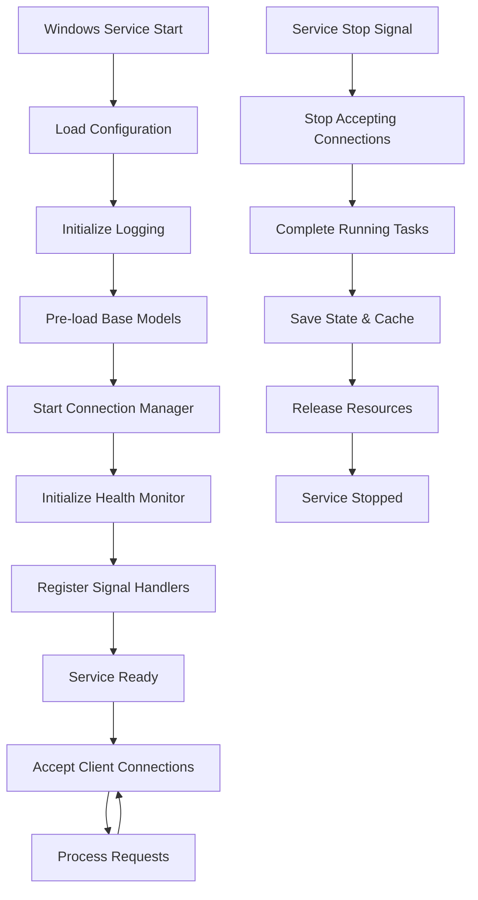

# MeetingScribe Daemon Service Specification

> **Windows Service** implementation with **Krisp-inspired** architecture for background AI transcription processing.

## 🎯 Service Overview

### Service Identity
- **Service Name**: `MeetingScribe`
- **Display Name**: `MeetingScribe AI Transcription Service`
- **Description**: `Background AI transcription service for meetings and audio processing`
- **Start Type**: Automatic (Delayed Start)
- **Service Type**: Own Process
- **Error Control**: Normal

### Krisp Comparison
| Feature | Krisp Service | MeetingScribe Service |
|---------|---------------|----------------------|
| **Auto-start** | ✅ System boot | ✅ System boot (delayed) |
| **User Context** | ✅ Current user | ✅ Current user |
| **Memory Usage** | ~100MB baseline | ~250MB baseline |
| **Crash Recovery** | ✅ Auto-restart | ✅ Auto-restart |
| **Model Persistence** | ✅ Always loaded | ✅ Whisper models cached |

## 🏗️ Service Architecture

### Component Structure

```
daemon/
├── service.py              # Windows Service wrapper (pywin32)
├── daemon_main.py          # Core daemon process  
├── stdio_core.py          # Adapted stdio_server.py
├── connection_manager.py  # Multi-client connection handling
├── health_monitor.py      # Health monitoring & recovery
├── resource_manager.py    # Memory & model management
├── installation.py        # Service installation utilities
└── service_config.py      # Service configuration
```

### Service Lifecycle



## 🔧 Implementation Details

### 1. Service Wrapper (`service.py`)

```python
import win32serviceutil
import win32service
import win32event
import servicemanager
import sys
import os
from pathlib import Path

class MeetingScribeService(win32serviceutil.ServiceFramework):
    _svc_name_ = "MeetingScribe"
    _svc_display_name_ = "MeetingScribe AI Transcription Service"
    _svc_description_ = "Background AI transcription service for meetings"
    _svc_deps_ = None  # No dependencies
    
    def __init__(self, args):
        win32serviceutil.ServiceFramework.__init__(self, args)
        self.hWaitStop = win32event.CreateEvent(None, 0, 0, None)
        self.daemon_process = None
        
    def SvcStop(self):
        """Stop the service gracefully"""
        self.ReportServiceStatus(win32service.SERVICE_STOP_PENDING)
        
        # Signal daemon to stop
        if self.daemon_process:
            self.daemon_process.stop_gracefully()
            
        win32event.SetEvent(self.hWaitStop)
        
    def SvcDoRun(self):
        """Main service execution"""
        servicemanager.LogMsg(
            servicemanager.EVENTLOG_INFORMATION_TYPE,
            servicemanager.PYS_SERVICE_STARTED,
            (self._svc_name_, '')
        )
        
        try:
            from daemon_main import DaemonMain
            self.daemon_process = DaemonMain()
            self.daemon_process.run()
            
            # Wait for stop signal
            win32event.WaitForSingleObject(self.hWaitStop, win32event.INFINITE)
            
        except Exception as e:
            servicemanager.LogErrorMsg(f"Service error: {e}")
            raise
        
        servicemanager.LogMsg(
            servicemanager.EVENTLOG_INFORMATION_TYPE,
            servicemanager.PYS_SERVICE_STOPPED,
            (self._svc_name_, '')
        )

if __name__ == '__main__':
    win32serviceutil.HandleCommandLine(MeetingScribeService)
```

### 2. Daemon Main Process (`daemon_main.py`)

```python
import asyncio
import signal
import sys
from pathlib import Path
from typing import Optional
from loguru import logger

from config import settings, setup_directories, setup_logging
from connection_manager import ConnectionManager
from health_monitor import HealthMonitor
from resource_manager import ResourceManager

class DaemonMain:
    """Main daemon process - Krisp-inspired architecture"""
    
    def __init__(self):
        self.running = False
        self.connection_manager: Optional[ConnectionManager] = None
        self.health_monitor: Optional[HealthMonitor] = None
        self.resource_manager: Optional[ResourceManager] = None
        self.loop: Optional[asyncio.AbstractEventLoop] = None
        
    def run(self):
        """Main entry point - similar to Krisp's service loop"""
        self.loop = asyncio.new_event_loop()
        asyncio.set_event_loop(self.loop)
        
        # Setup signal handlers
        signal.signal(signal.SIGINT, self._signal_handler)
        signal.signal(signal.SIGTERM, self._signal_handler)
        
        try:
            self.loop.run_until_complete(self._startup_sequence())
            self.loop.run_until_complete(self._main_loop())
        except Exception as e:
            logger.error(f"Daemon error: {e}")
        finally:
            self.loop.run_until_complete(self._shutdown_sequence())
            
    async def _startup_sequence(self):
        """Daemon startup - Krisp-style warm start"""
        logger.info("MeetingScribe Daemon starting...")
        
        # 1. Setup environment
        setup_directories()
        setup_logging()
        
        # 2. Initialize resource manager (pre-load models)
        self.resource_manager = ResourceManager()
        await self.resource_manager.initialize()
        
        # 3. Start connection manager
        self.connection_manager = ConnectionManager(self.resource_manager)
        await self.connection_manager.start()
        
        # 4. Start health monitor
        self.health_monitor = HealthMonitor(
            self.connection_manager,
            self.resource_manager
        )
        await self.health_monitor.start()
        
        self.running = True
        logger.info("MeetingScribe Daemon ready - accepting connections")
        
    async def _main_loop(self):
        """Main daemon loop"""
        while self.running:
            await asyncio.sleep(1)
            
            # Periodic maintenance (Krisp-style)
            if self.health_monitor:
                await self.health_monitor.check_health()
                
    async def _shutdown_sequence(self):
        """Graceful shutdown"""
        logger.info("MeetingScribe Daemon shutting down...")
        
        self.running = False
        
        # Stop accepting new connections
        if self.connection_manager:
            await self.connection_manager.stop()
            
        # Stop health monitoring  
        if self.health_monitor:
            await self.health_monitor.stop()
            
        # Release resources
        if self.resource_manager:
            await self.resource_manager.cleanup()
            
        logger.info("MeetingScribe Daemon stopped")
        
    def _signal_handler(self, signum, frame):
        """Handle shutdown signals"""
        logger.info(f"Received signal {signum}, initiating shutdown...")
        self.running = False
        
    def stop_gracefully(self):
        """External stop method for service wrapper"""
        self.running = False
```

### 3. Resource Manager (`resource_manager.py`)

```python
import asyncio
import psutil
from typing import Dict, Optional
from loguru import logger

from src.transcription import create_transcriber, WhisperModelSize

class ResourceManager:
    """Krisp-inspired resource management"""
    
    def __init__(self):
        self.model_cache: Dict[str, any] = {}
        self.memory_threshold = 1024 * 1024 * 1024  # 1GB limit
        self.model_idle_time = 300  # 5 minutes
        
    async def initialize(self):
        """Pre-load base model (Krisp-style warm start)"""
        logger.info("Pre-loading base Whisper model...")
        
        try:
            base_transcriber = create_transcriber(
                model_size=WhisperModelSize.BASE,
                device="auto"
            )
            self.model_cache['base'] = {
                'transcriber': base_transcriber,
                'last_used': asyncio.get_event_loop().time(),
                'memory_size': self._estimate_model_size('base')
            }
            
            logger.info(f"Base model loaded ({self._estimate_model_size('base'):.1f}MB)")
            
        except Exception as e:
            logger.error(f"Failed to pre-load base model: {e}")
            
    async def get_transcriber(self, model_size: str, device: str = "auto"):
        """Get transcriber with intelligent caching"""
        cache_key = f"{model_size}_{device}"
        
        # Check cache first
        if cache_key in self.model_cache:
            self.model_cache[cache_key]['last_used'] = asyncio.get_event_loop().time()
            return self.model_cache[cache_key]['transcriber']
            
        # Load on demand
        logger.info(f"Loading {model_size} model...")
        try:
            transcriber = create_transcriber(
                model_size=getattr(WhisperModelSize, model_size.upper()),
                device=device
            )
            
            # Check memory pressure before caching
            if self._check_memory_pressure():
                await self._evict_unused_models()
                
            self.model_cache[cache_key] = {
                'transcriber': transcriber,
                'last_used': asyncio.get_event_loop().time(),
                'memory_size': self._estimate_model_size(model_size)
            }
            
            return transcriber
            
        except Exception as e:
            logger.error(f"Failed to load {model_size} model: {e}")
            raise
            
    def _check_memory_pressure(self) -> bool:
        """Check if system is under memory pressure"""
        memory_info = psutil.virtual_memory()
        return memory_info.available < self.memory_threshold
        
    async def _evict_unused_models(self):
        """Evict least recently used models"""
        current_time = asyncio.get_event_loop().time()
        
        to_evict = []
        for key, model_info in self.model_cache.items():
            if current_time - model_info['last_used'] > self.model_idle_time:
                to_evict.append(key)
                
        for key in to_evict:
            if key != 'base':  # Never evict base model
                logger.info(f"Evicting unused model: {key}")
                del self.model_cache[key]
                
    def _estimate_model_size(self, model_size: str) -> float:
        """Estimate model memory usage (MB)"""
        sizes = {
            'tiny': 39,
            'base': 74,
            'small': 244,
            'medium': 769,
            'large': 1550,
            'large-v2': 1550,
            'large-v3': 1550
        }
        return sizes.get(model_size.lower(), 100)
        
    async def cleanup(self):
        """Clean up all resources"""
        logger.info("Cleaning up resources...")
        self.model_cache.clear()
```

## 🔧 Service Management

### Installation

```python
# daemon/installation.py
import subprocess
import sys
from pathlib import Path

def install_service():
    """Install MeetingScribe as Windows Service"""
    try:
        # Install service
        subprocess.run([
            sys.executable,
            str(Path(__file__).parent / "service.py"),
            "--startup=delayed",  # Krisp-style delayed start
            "install"
        ], check=True)
        
        # Start service
        subprocess.run([
            "sc", "start", "MeetingScribe"
        ], check=True)
        
        print("✅ MeetingScribe service installed and started")
        
    except subprocess.CalledProcessError as e:
        print(f"❌ Service installation failed: {e}")
        return False
        
    return True

def uninstall_service():
    """Uninstall MeetingScribe service"""
    try:
        # Stop service
        subprocess.run(["sc", "stop", "MeetingScribe"], 
                      capture_output=True)  # Don't fail if already stopped
        
        # Remove service
        subprocess.run([
            sys.executable,
            str(Path(__file__).parent / "service.py"),
            "remove"
        ], check=True)
        
        print("✅ MeetingScribe service uninstalled")
        
    except subprocess.CalledProcessError as e:
        print(f"❌ Service removal failed: {e}")
        return False
        
    return True

def service_status():
    """Check service status"""
    try:
        result = subprocess.run([
            "sc", "query", "MeetingScribe"
        ], capture_output=True, text=True, check=True)
        
        if "RUNNING" in result.stdout:
            return "running"
        elif "STOPPED" in result.stdout:
            return "stopped"
        else:
            return "unknown"
            
    except subprocess.CalledProcessError:
        return "not_installed"
```

### Service Configuration

```python
# daemon/service_config.py
from pydantic import BaseModel
from pathlib import Path

class ServiceConfig(BaseModel):
    # Service Identity
    service_name: str = "MeetingScribe"
    display_name: str = "MeetingScribe AI Transcription Service"
    description: str = "Background AI transcription service for meetings"
    
    # Startup Configuration
    start_type: str = "delayed"  # automatic, manual, disabled, delayed
    error_control: str = "normal"  # ignore, normal, severe, critical
    
    # Resource Limits (Krisp-inspired)
    max_memory_mb: int = 1024  # 1GB limit
    max_cpu_percent: int = 80   # 80% CPU limit
    model_cache_size: int = 3   # Max cached models
    
    # Connection Settings
    max_connections: int = 10
    connection_timeout: int = 30
    
    # Health Monitoring
    health_check_interval: int = 60  # seconds
    restart_on_failure: bool = True
    max_restart_attempts: int = 3
    
    # Logging
    log_level: str = "INFO"
    log_max_size: str = "50MB"
    log_retention: str = "30 days"
```

## 📊 Performance Targets (Krisp Benchmark)

### Service Metrics

| Metric | Target | Krisp Reference |
|--------|--------|-----------------|
| **Cold Start Time** | < 5s | < 2s |
| **Warm Start Time** | < 1s | < 1s |
| **Base Memory Usage** | ~250MB | ~100MB |
| **Peak Memory Usage** | < 1GB | < 500MB |
| **CPU Usage (Idle)** | < 5% | < 3% |
| **Connection Limit** | 10 concurrent | 50+ concurrent |

### Recovery Metrics

| Scenario | Target Response | Krisp Behavior |
|----------|-----------------|----------------|
| **Service Crash** | Auto-restart < 10s | Auto-restart < 5s |
| **Memory Pressure** | Model eviction | Graceful degradation |
| **Connection Loss** | Reconnect < 3s | Transparent reconnect |
| **Model Load Failure** | Fallback model | Error + retry |

---

## 🚀 Next Steps

### Implementation Priority
1. **Service Wrapper** → Basic Windows Service integration
2. **Resource Manager** → Model pre-loading and caching
3. **Connection Manager** → Multi-client support
4. **Health Monitor** → Reliability and recovery
5. **Installation Tools** → User-friendly deployment

### Testing Strategy
- **Service Lifecycle Tests** (install, start, stop, uninstall)
- **Performance Tests** (memory usage, startup time)
- **Reliability Tests** (crash recovery, long-running)
- **Multi-client Tests** (concurrent connections)

---

*Service Specification Version: 2.0*  
*Benchmark Reference: Krisp AI Service Architecture*  
*Last Updated: 2025-09-07*