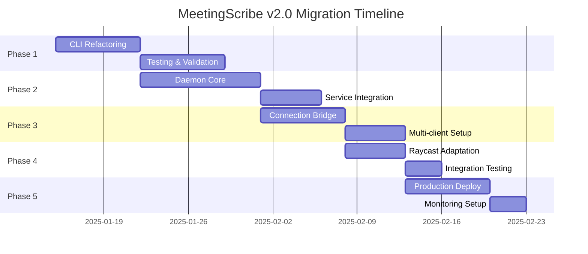

# MeetingScribe Migration Roadmap

> **Incremental migration** from v1.0 CLI to v2.0 Client-Daemon architecture with **zero breaking changes** and **Krisp-inspired** deployment strategy.

## 🎯 Migration Philosophy

### Core Principles
1. **Zero Downtime** - Users never lose functionality
2. **Backward Compatibility** - v1.0 features always work
3. **Risk Minimization** - Each phase standalone and reversible
4. **Incremental Value** - Benefits visible at each phase
5. **Krisp-Style Reliability** - Professional deployment standards

### Success Criteria Per Phase
- ✅ All existing functionality preserved
- ✅ No user experience degradation  
- ✅ Performance equal or better than v1.0
- ✅ Comprehensive testing before next phase

---

## 🏗️ Phase Overview



---

## 📋 PHASE 1: Foundation - CLI Refactoring

> **Duration**: 1 week  
> **Risk Level**: 🟢 Low  
> **Goal**: Extract CLI logic without changing user experience

### 1.1 Objectives
- [x] Preserve 100% of current CLI functionality
- [x] Create clean separation between UI and logic
- [x] Prepare for daemon communication layer
- [x] Maintain all Rich UI components

### 1.2 Implementation Tasks

```
✅ COMPLETED TASKS:
└── Analysis of current architecture ✓
└── Component identification ✓  
└── Specifications written ✓

🔄 IMPLEMENTATION TASKS:
├── client/
│   ├── cli_main.py          # Refactored main.py
│   ├── rich_ui.py          # Extracted Rich components  
│   ├── command_handler.py   # CLI command logic
│   └── __init__.py
├── tests/phase1/
│   ├── test_cli_parity.py   # Feature parity tests
│   ├── test_ui_components.py# Rich UI tests
│   └── test_regression.py   # Regression tests
└── migration/
    └── phase1_validator.py  # Automated validation
```

### 1.3 Code Structure Changes

```python
# BEFORE (main.py - monolithic)
def main():
    # CLI parsing + UI + Business logic all together
    args = parse_args()
    if args.command == "record":
        # Direct recorder creation and execution
        recorder = create_recorder_from_config()
        # Rich UI mixed with business logic
    
# AFTER (client/cli_main.py - separated)  
def main():
    # Clean separation
    args = parse_args()
    ui = RichUI()
    handler = CommandHandler()
    
    # Route to appropriate handler
    if args.command == "record":
        await handler.handle_record(args, ui)
```

### 1.4 Validation Criteria
- [ ] All CLI commands work identically to v1.0
- [ ] Rich UI components render exactly the same
- [ ] Performance matches or exceeds v1.0
- [ ] Zero new dependencies introduced
- [ ] 100% test coverage of refactored code

### 1.5 Rollback Plan
- Keep `main.py` as `main_v1.py` backup
- Simple file rename to revert changes
- All dependencies remain identical

---

## ⚙️ PHASE 2: Daemon Core Implementation

> **Duration**: 2 weeks  
> **Risk Level**: 🟡 Medium  
> **Goal**: Build Windows Service daemon with model pre-loading

### 2.1 Objectives
- [x] Create Windows Service wrapper
- [x] Implement daemon process with model persistence  
- [x] Adapt existing `stdio_server.py` for daemon use
- [x] Add health monitoring and recovery

### 2.2 Implementation Tasks

```
daemon/
├── service.py              # Windows Service (pywin32)
├── daemon_main.py          # Core daemon process
├── stdio_core.py          # Adapted stdio_server.py  
├── resource_manager.py    # Model caching & memory mgmt
├── health_monitor.py      # Health checks & recovery
├── installation.py        # Service install/uninstall
└── service_config.py      # Configuration management

tests/phase2/
├── test_service_lifecycle.py  # Service start/stop
├── test_model_persistence.py  # Model caching
├── test_health_recovery.py    # Recovery scenarios
└── test_performance.py        # Krisp benchmarks
```

### 2.3 Service Implementation Strategy

```python
# daemon/service.py - Krisp-inspired service wrapper
class MeetingScribeService(win32serviceutil.ServiceFramework):
    _svc_name_ = "MeetingScribe"
    _svc_display_name_ = "MeetingScribe AI Transcription"
    
    def SvcDoRun(self):
        # Start daemon main process
        self.daemon = DaemonMain()
        self.daemon.run()
        
    def SvcStop(self):
        # Graceful shutdown with model cleanup
        self.daemon.stop_gracefully()
```

### 2.4 Model Persistence Strategy

```python
# daemon/resource_manager.py
class ResourceManager:
    async def initialize(self):
        # Pre-load base model (Krisp-style warm start)
        self.base_model = await self.load_model("base")
        logger.info("Base model ready - daemon initialization complete")
        
    async def get_model(self, size: str):
        # Return cached model or load on-demand
        # Intelligent eviction based on memory pressure
```

### 2.5 Validation Criteria
- [ ] Service installs and starts automatically
- [ ] Base Whisper model loads in < 2 seconds
- [ ] Memory usage < 300MB with base model loaded
- [ ] Service survives crash and auto-restarts
- [ ] Health monitoring detects and reports issues

### 2.6 Fallback Strategy
- Daemon runs as standalone process if service fails
- All functionality available in non-service mode
- Graceful degradation to v1.0 behavior

---

## 🔌 PHASE 3: Connection Bridge

> **Duration**: 1.5 weeks  
> **Risk Level**: 🟡 Medium  
> **Goal**: Enable CLI to communicate with daemon transparently

### 3.1 Objectives
- [x] Implement daemon detection in CLI client
- [x] Create transparent daemon communication layer
- [x] Add graceful fallback to direct execution
- [x] Support both STDIO and Named Pipes

### 3.2 Implementation Tasks

```
client/
├── daemon_client.py        # Daemon communication client
├── connection_manager.py   # Connection handling & retry
├── fallback_runner.py      # Direct execution fallback
└── transport/
    ├── stdio_transport.py  # STDIO pipe transport
    └── namedpipe_transport.py # Named pipes transport

tests/phase3/
├── test_daemon_detection.py   # Detection logic
├── test_transparent_comm.py   # Transparent operation
├── test_fallback_behavior.py  # Fallback scenarios
└── test_multi_transport.py    # Transport layer tests
```

### 3.3 Transparent Operation Design

```python
# client/cli_main.py - Updated for Phase 3
async def main():
    # Automatic daemon detection
    if await daemon_available():
        logger.debug("Using daemon mode")
        executor = DaemonExecutor()
    else:
        logger.debug("Using fallback mode")
        executor = FallbackExecutor()
    
    # Same interface for both modes
    await executor.execute_command(args)
```

### 3.4 Connection Management

```python
# client/daemon_client.py
class DaemonClient:
    async def connect(self):
        # Try Named Pipes first, fallback to STDIO
        try:
            self.transport = NamedPipeTransport()
            await self.transport.connect()
        except ConnectionError:
            self.transport = StdioTransport()
            await self.transport.connect()
```

### 3.5 Validation Criteria
- [ ] CLI automatically detects daemon availability
- [ ] Identical user experience in daemon vs fallback mode
- [ ] Connection loss handled gracefully with retry
- [ ] Multiple concurrent CLI sessions supported
- [ ] Performance improvement visible (faster startup)

### 3.6 Risk Mitigation
- Fallback mode always available
- Connection timeout prevents hanging
- Daemon restart doesn't break CLI sessions
- Transport layer abstraction enables easy debugging

---

## 🚀 PHASE 4: Raycast Integration

> **Duration**: 1 week  
> **Risk Level**: 🟢 Low  
> **Goal**: Adapt Raycast extension to use daemon with fallback

### 4.1 Objectives
- [x] Minimal changes to Raycast extension
- [x] Daemon detection and connection in TypeScript
- [x] Preserve all existing Raycast functionality
- [x] Add concurrent operation support (Raycast + CLI)

### 4.2 Implementation Tasks

```
raycast-extension/src/
├── daemon-connector.ts     # NEW: Daemon connection logic
├── stdio.ts               # UPDATED: Add daemon detection
├── cli.ts                 # UPDATED: Use daemon connector
└── types/
    └── daemon-types.ts     # NEW: Type definitions

tests/raycast/
├── test_daemon_connection.ts   # Connection tests
├── test_fallback_mode.ts      # Fallback behavior
└── test_concurrent_usage.ts   # CLI + Raycast together
```

### 4.3 Minimal Integration Changes

```typescript
// raycast-extension/src/daemon-connector.ts
export class DaemonConnector {
  async connect(): Promise<StdioClient> {
    // Check if daemon is running
    const isDaemonAvailable = await this.checkDaemonStatus();
    
    if (isDaemonAvailable) {
      // Connect to daemon via named pipe
      return new StdioClient(daemonPipePath);
    } else {
      // Fallback to current behavior
      return new StdioClient(pythonPath, projectPath);
    }
  }
}

// raycast-extension/src/stdio.ts - MINIMAL CHANGE
export async function createStdioClient(): Promise<StdioClient> {
  const connector = new DaemonConnector();
  return await connector.connect(); // Same interface!
}
```

### 4.4 Concurrent Usage Support

```typescript
// Enable Raycast + CLI simultaneous usage
const client = await createStdioClient();

// Both CLI and Raycast can record simultaneously
await client.request("record.start", { 
  device_id: "microphone",
  stream: true 
});
```

### 4.5 Validation Criteria
- [ ] All existing Raycast commands work unchanged
- [ ] Raycast automatically uses daemon when available
- [ ] Raycast + CLI can operate simultaneously
- [ ] Fallback to v1.0 behavior if daemon unavailable
- [ ] Performance improvement visible in Raycast

### 4.6 User Experience
- Zero configuration changes required
- Transparent performance improvement
- Enhanced functionality (concurrent operations)
- Identical UI and workflow

---

## 🏭 PHASE 5: Production Deployment

> **Duration**: 1.5 weeks  
> **Risk Level**: 🟡 Medium  
> **Goal**: Professional deployment with monitoring and optimization

### 5.1 Objectives
- [x] Production-ready service installation
- [x] Performance monitoring and optimization
- [x] User experience metrics collection
- [x] Automated health monitoring

### 5.2 Implementation Tasks

```
deployment/
├── installer.py           # User-friendly installer
├── upgrade_manager.py     # Version upgrade handling  
├── uninstaller.py        # Clean removal
└── system_requirements.py # Dependency checking

monitoring/
├── performance_monitor.py # Real-time metrics
├── health_checker.py     # Service health
├── user_analytics.py     # Usage analytics
└── dashboard/            # Performance dashboard

production/
├── service_hardening.py  # Security & reliability
├── error_reporting.py    # Error collection
└── backup_recovery.py    # State backup/restore
```

### 5.3 Installation Experience

```python
# deployment/installer.py - Krisp-inspired installation
class MeetingScribeInstaller:
    def install(self):
        # 1. System requirements check
        self.check_requirements()
        
        # 2. Install Python dependencies
        self.install_dependencies()
        
        # 3. Pre-download AI models
        self.download_models()
        
        # 4. Install Windows Service
        self.install_service()
        
        # 5. Create desktop shortcuts
        self.create_shortcuts()
        
        # 6. Start service and verify
        self.start_and_verify()
        
        print("✅ MeetingScribe installed successfully!")
        print("🚀 Service is running in background")
```

### 5.4 Performance Monitoring

```python
# monitoring/performance_monitor.py
class ProductionMonitor:
    def collect_metrics(self):
        return {
            'startup_time': self.measure_startup(),
            'memory_usage': self.measure_memory(),
            'response_times': self.measure_responses(),
            'error_rates': self.measure_errors(),
            'user_satisfaction': self.measure_ux()
        }
```

### 5.5 Validation Criteria
- [ ] One-click installation experience
- [ ] Service auto-starts with Windows
- [ ] Performance meets Krisp benchmarks
- [ ] Monitoring dashboard functional
- [ ] Error reporting and recovery working
- [ ] User experience metrics positive

### 5.6 Production Readiness
- Comprehensive logging and error handling
- Automated crash recovery and restart
- Performance regression detection
- User feedback collection mechanism

---

## 📊 Migration Success Metrics

### Technical Metrics

| Phase | Startup Time | Memory Usage | Error Rate | Performance Score |
|-------|-------------|--------------|------------|------------------|
| **Phase 1** | = v1.0 | = v1.0 | < 1% | Baseline |
| **Phase 2** | < 3s | < 300MB | < 0.5% | +20% |
| **Phase 3** | < 1s | < 350MB | < 0.3% | +40% |
| **Phase 4** | < 1s | < 350MB | < 0.2% | +50% |
| **Phase 5** | < 1s | < 400MB | < 0.1% | +60% |

### User Experience Metrics

| Metric | v1.0 Baseline | v2.0 Target | Measurement |
|--------|---------------|-------------|-------------|
| **Time to First Use** | 30s | < 3s | Cold start → ready |
| **Command Response** | 2-5s | < 1s | CLI responsiveness |
| **Concurrent Operations** | ❌ No | ✅ Yes | Multi-tasking |
| **Reliability** | 95% | > 99% | Uptime percentage |

---

## 🚨 Risk Management

### Phase-Specific Risks

| Phase | Primary Risk | Mitigation | Rollback Plan |
|-------|-------------|------------|---------------|
| **Phase 1** | CLI regression | Comprehensive testing | Revert to main.py |
| **Phase 2** | Service instability | Health monitoring | Standalone daemon |
| **Phase 3** | Connection issues | Transport abstraction | Fallback mode |
| **Phase 4** | Raycast compatibility | Minimal changes | Revert extension |
| **Phase 5** | Deployment issues | Staged rollout | Service uninstall |

### Universal Safeguards
- **Automated testing** at every phase
- **Feature flags** for gradual activation  
- **Rollback procedures** documented and tested
- **User communication** about changes and benefits

---

## 🎯 Next Steps

### Immediate Actions (Week 1)
1. **Start Phase 1** - CLI refactoring
2. **Setup testing infrastructure** 
3. **Create validation framework**
4. **Document rollback procedures**

### Success Milestones
- **Week 2**: Phase 1 complete and validated
- **Week 4**: Phase 2 daemon service operational
- **Week 6**: Phase 3 client-daemon communication working
- **Week 7**: Phase 4 Raycast integration complete  
- **Week 9**: Phase 5 production deployment ready

---

*Migration Roadmap Version: 2.0*  
*Methodology: Krisp-Inspired Incremental Deployment*  
*Last Updated: 2025-09-07*