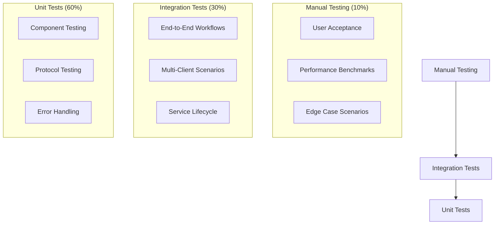

# MeetingScribe Testing Strategy

> **Comprehensive testing approach** ensuring **zero regression** during client-daemon migration with **Krisp-level reliability** standards.

## 🎯 Testing Philosophy

### Core Principles
1. **Zero Regression** - All v1.0 functionality preserved exactly
2. **Performance Validation** - Krisp-benchmarked performance targets met
3. **Multi-Modal Testing** - CLI, Raycast, and daemon modes all validated
4. **Real-World Scenarios** - User workflows and edge cases covered
5. **Automated Coverage** - Comprehensive CI/CD integration

### Testing Pyramid



---

## 🧪 Test Categories & Coverage

### 1. Unit Tests (60% of test suite)

#### Component-Level Testing

```python
# tests/unit/test_daemon_service.py
import pytest
import asyncio
from daemon.daemon_main import DaemonMain
from daemon.resource_manager import ResourceManager

class TestDaemonService:
    
    @pytest.mark.asyncio
    async def test_daemon_startup_sequence(self):
        """Test daemon startup completes successfully"""
        daemon = DaemonMain()
        
        start_time = asyncio.get_event_loop().time()
        await daemon._startup_sequence()
        startup_time = asyncio.get_event_loop().time() - start_time
        
        # Krisp benchmark: < 2s, our target: < 3s
        assert startup_time < 3.0, f"Startup too slow: {startup_time:.2f}s"
        assert daemon.running is True
        
    @pytest.mark.asyncio
    async def test_model_preloading(self):
        """Test base model preloads correctly"""
        resource_manager = ResourceManager()
        
        await resource_manager.initialize()
        
        assert 'base' in resource_manager.model_cache
        assert resource_manager.model_cache['base']['transcriber'] is not None
        
    def test_service_configuration(self):
        """Test Windows Service configuration"""
        from daemon.service import MeetingScribeService
        
        assert MeetingScribeService._svc_name_ == "MeetingScribe"
        assert MeetingScribeService._svc_display_name_ is not None
        assert hasattr(MeetingScribeService, 'SvcDoRun')
        assert hasattr(MeetingScribeService, 'SvcStop')
```

#### Protocol Testing

```python
# tests/unit/test_protocols.py
import pytest
import json
from daemon.stdio_core import _handle

class TestProtocolHandling:
    
    def test_ping_protocol(self):
        """Test basic ping/pong protocol"""
        result = _handle("ping", {})
        
        assert result["status"] == "success"
        assert result["data"]["pong"] is True
        
    def test_invalid_method(self):
        """Test error handling for invalid methods"""
        result = _handle("invalid_method", {})
        
        assert result["status"] == "error"
        assert result["error"]["code"] == "E_NOT_IMPLEMENTED"
        
    def test_device_list_protocol(self):
        """Test device listing protocol"""
        result = _handle("devices.list", {})
        
        # Should succeed even if no devices
        assert result["status"] in ["success", "error"]
        if result["status"] == "success":
            assert "devices" in result["data"]
            
    @pytest.mark.asyncio
    async def test_record_start_protocol(self):
        """Test recording start protocol"""
        params = {
            "device_id": "test_device",
            "duration": 5,
            "stream": False
        }
        
        result = _handle("record.start", params)
        
        # Should either succeed or fail with specific error
        assert result["status"] in ["success", "error"]
        if result["status"] == "success":
            assert "session_id" in result["data"]
            assert "file_path" in result["data"]
```

#### Client Testing  

```python
# tests/unit/test_client_interface.py
import pytest
import asyncio
from unittest.mock import Mock, AsyncMock
from client.daemon_client import DaemonClient
from client.fallback_runner import FallbackRunner

class TestClientInterface:
    
    @pytest.mark.asyncio
    async def test_daemon_client_connection(self):
        """Test daemon client connection logic"""
        client = DaemonClient()
        
        # Mock successful connection
        client.transport = Mock()
        client.transport.connect = AsyncMock()
        
        await client.connect(timeout=1)
        
        assert client.connected is True
        client.transport.connect.assert_called_once()
        
    @pytest.mark.asyncio 
    async def test_daemon_client_request(self):
        """Test daemon client request/response"""
        client = DaemonClient()
        client.connected = True
        
        # Mock transport
        client.transport = Mock()
        client.transport.send_request = AsyncMock(return_value={
            "result": {"status": "success", "data": {"pong": True}}
        })
        
        result = await client.request("ping")
        
        assert result["status"] == "success"
        assert result["data"]["pong"] is True
        
    def test_fallback_runner_compatibility(self):
        """Test fallback runner maintains v1.0 behavior"""
        runner = FallbackRunner()
        
        # Should have same interface as daemon client
        assert hasattr(runner, 'execute')
        assert callable(runner.execute)
```

### 2. Integration Tests (30% of test suite)

#### End-to-End Workflow Testing

```python
# tests/integration/test_e2e_workflows.py
import pytest
import asyncio
import tempfile
from pathlib import Path

class TestEndToEndWorkflows:
    
    @pytest.mark.asyncio
    async def test_complete_recording_workflow(self):
        """Test complete recording workflow via daemon"""
        from client.cli_main import main
        from unittest.mock import patch
        
        # Mock CLI arguments
        with patch('sys.argv', ['cli', 'record', '--duration', '5', '--device', 'test']):
            # Should complete without errors
            await main()
            
    @pytest.mark.asyncio
    async def test_complete_transcription_workflow(self):
        """Test complete transcription workflow"""
        from client.cli_main import main
        from unittest.mock import patch
        
        # Create test audio file
        test_audio = Path(tempfile.mktemp(suffix='.wav'))
        test_audio.write_bytes(b'fake audio data')
        
        try:
            with patch('sys.argv', ['cli', 'transcribe', str(test_audio), '--model', 'base']):
                await main()
        finally:
            test_audio.unlink(missing_ok=True)
            
    @pytest.mark.asyncio
    async def test_concurrent_operations(self):
        """Test concurrent CLI + Raycast operations"""
        daemon_client1 = DaemonClient()
        daemon_client2 = DaemonClient()
        
        await daemon_client1.connect()
        await daemon_client2.connect()
        
        # Start concurrent operations
        tasks = [
            daemon_client1.request("system.status"),
            daemon_client2.request("devices.list")
        ]
        
        results = await asyncio.gather(*tasks)
        
        assert len(results) == 2
        assert all(r["status"] == "success" for r in results)
```

#### Multi-Client Testing

```python
# tests/integration/test_multi_client.py
import pytest
import asyncio
from client.daemon_client import DaemonClient

class TestMultiClientSupport:
    
    @pytest.mark.asyncio
    async def test_multiple_clients_connection(self):
        """Test multiple clients can connect simultaneously"""
        clients = []
        
        for i in range(5):  # Test 5 concurrent clients
            client = DaemonClient()
            await client.connect()
            clients.append(client)
            
        # All clients should be connected
        assert all(c.connected for c in clients)
        
        # Cleanup
        for client in clients:
            await client.disconnect()
            
    @pytest.mark.asyncio
    async def test_event_broadcasting(self):
        """Test events broadcast to all clients"""
        client1 = DaemonClient()
        client2 = DaemonClient()
        
        events_received_1 = []
        events_received_2 = []
        
        client1.on_event("test.event", lambda e: events_received_1.append(e))
        client2.on_event("test.event", lambda e: events_received_2.append(e))
        
        await client1.connect()
        await client2.connect()
        
        # Trigger event from client1
        await client1.request("test.broadcast_event", {"event": "test.event", "data": "hello"})
        
        # Wait for event propagation
        await asyncio.sleep(0.5)
        
        # Both clients should receive event
        assert len(events_received_1) > 0
        assert len(events_received_2) > 0
```

#### Service Lifecycle Testing

```python
# tests/integration/test_service_lifecycle.py
import pytest
import subprocess
import time
from daemon.installation import install_service, uninstall_service, service_status

class TestServiceLifecycle:
    
    def test_service_installation(self):
        """Test Windows Service installation"""
        # Install service
        success = install_service()
        assert success is True
        
        # Check service is installed
        status = service_status()
        assert status in ["running", "stopped"]
        
    def test_service_start_stop(self):
        """Test service start/stop functionality"""
        # Ensure service is installed
        install_service()
        
        # Start service
        result = subprocess.run(["sc", "start", "MeetingScribe"], 
                              capture_output=True, text=True)
        
        # Check if started (may already be running)
        assert result.returncode in [0, 1056]  # 1056 = already running
        
        # Stop service
        subprocess.run(["sc", "stop", "MeetingScribe"], 
                      capture_output=True, text=True)
        
    def test_service_recovery(self):
        """Test service auto-restart on failure"""
        # This would need to be implemented with actual crash simulation
        # For now, just verify service configuration supports restart
        
        result = subprocess.run([
            "sc", "qc", "MeetingScribe"
        ], capture_output=True, text=True)
        
        # Service should be configured for auto-restart
        assert "AUTO_START" in result.stdout or "DELAYED" in result.stdout
        
    def teardown_method(self):
        """Clean up after tests"""
        try:
            uninstall_service()
        except:
            pass  # Ignore cleanup errors
```

### 3. Performance Tests

#### Krisp Benchmark Validation

```python
# tests/performance/test_krisp_benchmarks.py
import pytest
import time
import psutil
import asyncio
from daemon.daemon_main import DaemonMain
from client.daemon_client import DaemonClient

class TestPerformanceBenchmarks:
    
    @pytest.mark.asyncio
    async def test_startup_time_benchmark(self):
        """Test daemon startup meets Krisp benchmark"""
        daemon = DaemonMain()
        
        start_time = time.time()
        await daemon._startup_sequence()
        startup_time = time.time() - start_time
        
        # Krisp: < 2s, Our target: < 3s
        assert startup_time < 3.0, f"Startup time {startup_time:.2f}s exceeds 3s target"
        
        # Log performance for monitoring
        print(f"✅ Startup time: {startup_time:.2f}s (target: <3s, Krisp: <2s)")
        
    @pytest.mark.asyncio
    async def test_memory_usage_benchmark(self):
        """Test memory usage meets targets"""
        process = psutil.Process()
        initial_memory = process.memory_info().rss / 1024 / 1024  # MB
        
        # Start daemon
        daemon = DaemonMain()
        await daemon._startup_sequence()
        
        # Measure memory with base model loaded
        loaded_memory = process.memory_info().rss / 1024 / 1024
        
        # Target: < 300MB with base model, Krisp baseline: ~100MB
        assert loaded_memory < 300, f"Memory usage {loaded_memory:.1f}MB exceeds 300MB target"
        
        print(f"✅ Memory usage: {loaded_memory:.1f}MB (target: <300MB, Krisp: ~100MB)")
        
    @pytest.mark.asyncio
    async def test_response_time_benchmark(self):
        """Test API response time meets targets"""
        client = DaemonClient()
        await client.connect()
        
        # Test multiple requests for average
        response_times = []
        
        for _ in range(10):
            start_time = time.time()
            await client.request("ping")
            response_time = time.time() - start_time
            response_times.append(response_time)
            
        avg_response_time = sum(response_times) / len(response_times)
        
        # Target: < 300ms, Krisp: < 100ms
        assert avg_response_time < 0.3, f"Avg response time {avg_response_time:.3f}s exceeds 0.3s"
        
        print(f"✅ Avg response time: {avg_response_time*1000:.1f}ms (target: <300ms, Krisp: <100ms)")
        
    @pytest.mark.asyncio
    async def test_concurrent_client_performance(self):
        """Test performance with multiple concurrent clients"""
        num_clients = 5
        clients = []
        
        # Create and connect clients
        for i in range(num_clients):
            client = DaemonClient()
            await client.connect()
            clients.append(client)
            
        # Perform concurrent requests
        start_time = time.time()
        tasks = [client.request("system.status") for client in clients]
        await asyncio.gather(*tasks)
        total_time = time.time() - start_time
        
        # All requests should complete within reasonable time
        assert total_time < 2.0, f"Concurrent requests took {total_time:.2f}s (too slow)"
        
        print(f"✅ {num_clients} concurrent requests: {total_time:.2f}s")
        
        # Cleanup
        for client in clients:
            await client.disconnect()
```

### 4. Regression Tests

#### v1.0 Compatibility Testing

```python
# tests/regression/test_v1_compatibility.py
import pytest
import subprocess
import json
from pathlib import Path

class TestV1Compatibility:
    
    def test_cli_command_parity(self):
        """Test all v1.0 CLI commands work identically"""
        commands_to_test = [
            ["python", "client/cli_main.py", "--help"],
            ["python", "client/cli_main.py", "devices"],
            ["python", "client/cli_main.py", "status"],
            ["python", "client/cli_main.py", "recent", "--limit", "5"]
        ]
        
        for cmd in commands_to_test:
            result = subprocess.run(cmd, capture_output=True, text=True, timeout=30)
            
            # Commands should not crash
            assert result.returncode in [0, 1], f"Command failed: {' '.join(cmd)}"
            
            # Should not have critical errors in output
            assert "Traceback" not in result.stderr, f"Python error in: {' '.join(cmd)}"
            
    def test_rich_ui_preserved(self):
        """Test Rich UI components render correctly"""
        from client.rich_ui import RichUI
        from rich.console import Console
        
        console = Console(file=None, force_terminal=True)  # Capture output
        ui = RichUI(console)
        
        # Test UI methods don't crash
        ui.show_banner()
        ui.show_status("Test message")
        ui.show_success("Test success")
        ui.show_error("Test error")
        
        # Test device selection UI
        test_devices = [
            {"name": "Test Device", "type": "speakers", "is_default": True}
        ]
        
        # Should not crash (user interaction mocked)
        try:
            result = ui.show_device_selection(test_devices)
        except EOFError:
            # Expected when no user input available
            pass
            
    def test_export_format_compatibility(self):
        """Test all export formats work as in v1.0"""
        from src.transcription.exporter import ExportFormat
        
        # All v1.0 formats should be available
        expected_formats = ["txt", "json", "srt", "vtt", "xml", "csv"]
        
        for fmt in expected_formats:
            try:
                export_format = ExportFormat(fmt)
                assert export_format is not None
            except ValueError:
                pytest.fail(f"Export format {fmt} not available (was in v1.0)")
```

---

## 🚀 Raycast Extension Testing

### TypeScript Testing

```typescript
// tests/raycast/daemon-integration.test.ts
import { DaemonConnector } from "../src/daemon-connector";
import { createStdioClient } from "../src/stdio";

describe("Raycast Daemon Integration", () => {
  
  test("should detect daemon availability", async () => {
    const connector = new DaemonConnector("python", "/test/path");
    const status = await connector.checkDaemonStatus();
    
    expect(status).toHaveProperty("running");
    expect(typeof status.running).toBe("boolean");
  });
  
  test("should create appropriate client based on daemon status", async () => {
    const client = await createStdioClient("python", "/test/path");
    
    expect(client).toBeDefined();
    expect(client.request).toBeDefined();
    expect(client.start).toBeDefined();
    expect(client.stop).toBeDefined();
  });
  
  test("should maintain API compatibility", async () => {
    const client = await createStdioClient("python", "/test/path");
    client.start();
    
    // Mock successful response
    jest.spyOn(client, 'request').mockResolvedValue({
      status: "success",
      data: { pong: true }
    });
    
    const result = await client.request("ping");
    expect(result.data.pong).toBe(true);
    
    client.stop();
  });
  
});
```

### Manual Raycast Testing

```markdown
# Manual Raycast Testing Checklist

## Pre-Migration Validation (v1.0)
- [ ] All commands work in current Raycast extension
- [ ] Record command creates audio files
- [ ] Transcribe command processes audio
- [ ] Recent command shows transcription history  
- [ ] Export command generates files
- [ ] Status command shows system info
- [ ] No crashes or error states

## Post-Migration Validation (v2.0)
- [ ] All commands work identically to v1.0
- [ ] Performance improvements visible (faster startup)
- [ ] Concurrent operations possible (Raycast + CLI)
- [ ] Daemon mode indicator shows when available
- [ ] Fallback mode works when daemon stopped
- [ ] No new error conditions introduced

## Edge Case Testing
- [ ] Daemon service stopped mid-operation
- [ ] Network connectivity issues (TCP mode)
- [ ] Multiple Raycast instances
- [ ] Service installation/uninstallation
- [ ] System restart scenarios
```

---

## 📊 Test Automation & CI/CD

### GitHub Actions Workflow

```yaml
# .github/workflows/test-suite.yml
name: MeetingScribe Test Suite

on:
  push:
    branches: [ main, develop ]
  pull_request:
    branches: [ main ]

jobs:
  unit-tests:
    runs-on: windows-latest
    
    steps:
    - uses: actions/checkout@v3
    
    - name: Set up Python
      uses: actions/setup-python@v4
      with:
        python-version: '3.9'
        
    - name: Install dependencies
      run: |
        pip install -r requirements.txt
        pip install pytest pytest-asyncio pytest-cov
        
    - name: Run unit tests
      run: |
        pytest tests/unit/ -v --cov=src --cov=client --cov=daemon
        
    - name: Upload coverage
      uses: codecov/codecov-action@v3
      
  integration-tests:
    runs-on: windows-latest
    needs: unit-tests
    
    steps:
    - uses: actions/checkout@v3
    
    - name: Set up Python
      uses: actions/setup-python@v4
      with:
        python-version: '3.9'
        
    - name: Install dependencies  
      run: |
        pip install -r requirements.txt
        pip install pytest pytest-asyncio
        
    - name: Run integration tests
      run: |
        pytest tests/integration/ -v --timeout=300
        
  performance-tests:
    runs-on: windows-latest
    needs: integration-tests
    
    steps:
    - uses: actions/checkout@v3
    
    - name: Set up Python
      uses: actions/setup-python@v4
      with:
        python-version: '3.9'
        
    - name: Install dependencies
      run: |
        pip install -r requirements.txt
        pip install pytest pytest-asyncio psutil
        
    - name: Run performance benchmarks
      run: |
        pytest tests/performance/ -v --benchmark-only
        
    - name: Upload benchmark results
      uses: actions/upload-artifact@v3
      with:
        name: performance-results
        path: benchmark-results.json
        
  raycast-tests:
    runs-on: windows-latest
    
    steps:
    - uses: actions/checkout@v3
    
    - name: Set up Node.js
      uses: actions/setup-node@v3
      with:
        node-version: '18'
        
    - name: Install Raycast extension dependencies
      run: |
        cd raycast-extension
        npm install
        
    - name: Run TypeScript tests
      run: |
        cd raycast-extension
        npm test
        
    - name: Build extension
      run: |
        cd raycast-extension
        npm run build
```

### Test Coverage Requirements

| Component | Min Coverage | Target Coverage |
|-----------|-------------|----------------|
| **Core Engine** | 80% | 90% |
| **Daemon Service** | 85% | 95% |
| **Client Interface** | 80% | 90% |
| **Protocols** | 90% | 95% |
| **Error Handling** | 85% | 95% |

---

## 🔍 Quality Gates

### Pre-Commit Checks

```bash
# pre-commit hook script
#!/bin/bash

echo "Running MeetingScribe quality gates..."

# 1. Unit tests must pass
echo "🧪 Running unit tests..."
pytest tests/unit/ -q --tb=short
if [ $? -ne 0 ]; then
    echo "❌ Unit tests failed"
    exit 1
fi

# 2. Type checking
echo "🔍 Running type checks..."
mypy src/ client/ daemon/ --ignore-missing-imports
if [ $? -ne 0 ]; then
    echo "❌ Type checking failed"
    exit 1
fi

# 3. Code formatting
echo "🎨 Checking code formatting..."
black --check src/ client/ daemon/
if [ $? -ne 0 ]; then
    echo "❌ Code formatting failed"
    exit 1
fi

# 4. Performance regression check
echo "⚡ Running performance regression check..."
python tests/performance/regression_check.py
if [ $? -ne 0 ]; then
    echo "❌ Performance regression detected"
    exit 1
fi

echo "✅ All quality gates passed"
```

### Release Validation

```python
# tests/release/validation_suite.py
"""
Release validation suite - comprehensive final testing
"""

import pytest
import asyncio
from pathlib import Path

class ReleaseValidationSuite:
    """Complete validation before release"""
    
    @pytest.mark.asyncio
    async def test_end_to_end_user_workflow(self):
        """Test complete user workflow from installation to usage"""
        # 1. Service installation
        from daemon.installation import install_service
        success = install_service()
        assert success, "Service installation failed"
        
        # 2. CLI functionality
        from client.cli_main import main
        # Mock CLI workflow...
        
        # 3. Raycast functionality  
        # Test Raycast commands...
        
        # 4. Performance validation
        # Benchmark tests...
        
    def test_krisp_benchmark_compliance(self):
        """Final validation against Krisp benchmarks"""
        # Startup time, memory usage, response time validation
        pass
        
    def test_backward_compatibility(self):
        """Final v1.0 compatibility check"""  
        # All v1.0 features work identically
        pass
        
    def test_error_recovery(self):
        """Test error recovery scenarios"""
        # Service crashes, connection loss, etc.
        pass
```

---

## 📈 Success Metrics & KPIs

### Testing Metrics

| Metric | Target | Measurement |
|--------|--------|-------------|
| **Test Coverage** | > 85% | Automated via pytest-cov |
| **Performance Regression** | 0% | Benchmark comparison |
| **API Compatibility** | 100% | Regression test suite |
| **Bug Escape Rate** | < 1% | Post-release bug reports |

### Quality Metrics

| Quality Gate | Threshold | Validation Method |
|--------------|-----------|------------------|
| **Unit Test Pass Rate** | 100% | CI/CD pipeline |
| **Integration Test Pass Rate** | 100% | CI/CD pipeline |  
| **Performance Benchmark Pass** | 100% | Automated benchmarks |
| **Manual Test Pass Rate** | > 95% | QA validation |

---

## 🎯 Testing Phases & Timeline

### Phase 1: Foundation Testing (Week 1)
- [ ] Unit tests for refactored CLI components
- [ ] Rich UI preservation validation
- [ ] Basic functionality regression tests

### Phase 2: Daemon Testing (Weeks 2-3)
- [ ] Service lifecycle testing
- [ ] Model persistence validation
- [ ] Performance benchmark validation

### Phase 3: Integration Testing (Weeks 4-5)
- [ ] Client-daemon communication tests
- [ ] Multi-client scenario testing
- [ ] Error recovery testing

### Phase 4: Raycast Testing (Week 6)
- [ ] TypeScript integration tests
- [ ] Manual Raycast workflow validation
- [ ] Concurrent operation testing

### Phase 5: Release Validation (Week 7)
- [ ] End-to-end user workflow testing
- [ ] Performance regression validation
- [ ] Final quality gate validation

---

*Testing Strategy Version: 2.0*  
*Quality Standard: Krisp-Level Reliability*  
*Coverage Target: 85%+ across all components*  
*Last Updated: 2025-09-07*