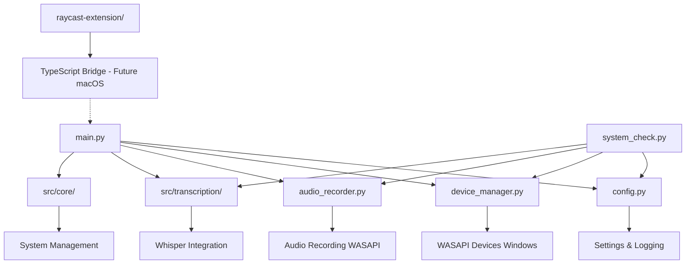
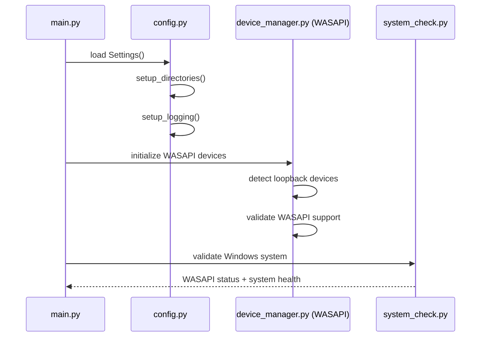
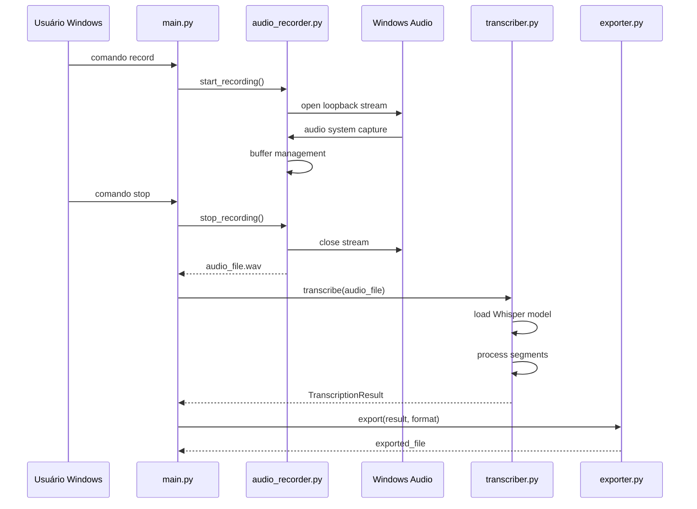

# MeetingScribe - Arquitetura Atual

## Visão Geral

O MeetingScribe é um sistema de transcrição de áudio baseado em inteligência artificial, projetado especificamente para Windows com suporte a WASAPI. A arquitetura fornece transcrição de alta qualidade usando OpenAI Whisper com processamento 100% local, otimizada para captura de áudio do sistema Windows.

## Arquitetura dos Módulos

### Estrutura Hierárquica



### Módulos Principais

#### 1. **Core Configuration Layer**
- **config.py**: Configuração centralizada usando Pydantic BaseSettings
  - Gerencia configurações de áudio, Whisper, diretórios
  - Suporte a variáveis de ambiente (.env)
  - Setup automático de diretórios e logging
  - Pattern: Configuration Object com validação de tipos

#### 2. **Audio Subsystem (Windows-focused)**
- **device_manager.py**: Gerenciamento de dispositivos WASAPI
  - Detecção automática de dispositivos de loopback Windows
  - Suporte a pyaudiowpatch para captura nativa do sistema
  - Compatibilidade com Windows Audio Session API
  - Pattern: Manager com Context Manager
  
- **audio_recorder.py**: Gravação de áudio WASAPI em tempo real
  - Gravação WASAPI com threading otimizado para Windows
  - Controle de estado (start/stop/pause)
  - Estatísticas de gravação em tempo real
  - Pattern: State Machine com Observer

#### 3. **Transcription Engine (src/transcription/)**
- **transcriber.py**: Core do Whisper com faster-whisper
  - Múltiplos tamanhos de modelo (tiny → large-v3)
  - Auto-detecção de hardware (GPU/CPU) Windows
  - Progress tracking e callback system
  - Pattern: Strategy + Observer
  
- **intelligent_transcriber.py**: Recursos avançados
  - Detecção de speakers com pyannote.audio
  - Processamento otimizado por chunks
  - Pattern: Decorator + Pipeline
  
- **exporter.py**: Exportação multi-formato
  - Formatos: TXT, JSON, SRT, VTT, XML, CSV
  - Templates personalizáveis
  - Pattern: Strategy + Template Method

- **speaker_detection.py**: Identificação de falantes
  - Integração com pyannote.audio
  - Diarização automática
  - Pattern: Pipeline Processing

#### 4. **Core Services (src/core/)**
- **file_manager.py**: Gerenciamento de arquivos de transcrição
- **hardware_detection.py**: Detecção automática de capacidades do hardware Windows
- **settings_manager.py**: Gerenciamento avançado de configurações

#### 5. **System Validation**
- **system_check.py**: Diagnóstico completo do sistema Windows
  - Verificação de dependências Python
  - Validação de dispositivos WASAPI
  - Status de modelos Whisper
  - Detecção de drivers de áudio Windows

#### 6. **Entry Point**
- **main.py**: Interface CLI com Rich
  - Comandos interativos e não-interativos
  - Suporte a JSON para integração externa
  - Progress tracking visual
  - Pattern: Command + Facade

#### 7. **Cross-Platform Extension (Future)**
- **raycast-extension/**: Bridge TypeScript-Python (para futuro suporte macOS)
  - Comandos: record, recent, transcribe, status, export
  - Comunicação via JSON com processo Python
  - Planejado para expansão multiplataforma

## Fluxo de Dados

### 1. Inicialização do Sistema Windows



### 2. Fluxo de Gravação WASAPI e Transcrição



### 3. Comunicação config.py ↔ main.py ↔ system_check.py

#### **config.py → main.py**
- Settings singleton pattern
- Configurações específicas para Windows (WASAPI, paths)
- Setup de logging com paths Windows
- Validação de tipos via Pydantic

#### **main.py → system_check.py**
- Validação de dependências Python Windows
- Verificação específica de dispositivos WASAPI
- Status do sistema Windows para interface
- Detecção de drivers de áudio Windows

#### **Fluxo de Configuração Windows**
```python
# config.py
settings = Settings()  # Singleton global
setup_directories()    # Cria estrutura Windows-friendly
setup_logging()       # Configura Loguru com paths Windows

# main.py  
from config import settings  # Importa singleton
initialize_system()          # Usa configurações Windows

# system_check.py
from config import settings  # Mesmas configurações
check_windows_audio()       # Valida WASAPI especificamente
```

## Padrões Arquiteturais Implementados

### 1. **Configuration Object Pattern**
- `config.py` centraliza todas as configurações Windows
- Validação automática com Pydantic
- Suporte a environment variables
- Paths Windows-friendly

### 2. **Manager Pattern**
- `DeviceManager` para dispositivos WASAPI Windows
- `FileManager` para arquivos com paths Windows
- `SettingsManager` para configurações Windows
- Context managers para resource cleanup WASAPI

### 3. **Strategy Pattern**
- `TranscriptionConfig` para diferentes modelos Whisper
- `ExportFormat` para múltiplos formatos de saída
- `PerformanceLevel` para otimizações baseadas em hardware Windows

### 4. **Observer Pattern**
- Callbacks de progresso em `transcriber.py`
- Progress tracking em `audio_recorder.py`
- Event notification system

### 5. **Factory Pattern**
- `create_transcriber()` para instanciação otimizada
- `create_recorder_from_config()` para gravadores WASAPI
- `create_intelligent_transcriber()` para recursos avançados

## Decisões de Design do Sistema

### 1. **WASAPI via pyaudiowpatch**
- **Decisão**: Capture nativo do sistema Windows
- **Benefícios**: Audio loopback sem configuração manual
- **Trade-offs**: Windows-specific vs. funcionalidade superior

### 2. **Foco em Windows**
- **Decisão**: Otimização primária para Windows
- **Benefícios**: Melhor integração WASAPI, performance superior
- **Trade-offs**: Portabilidade vs. qualidade de áudio

### 3. **faster-whisper sobre openai-whisper**
- **Decisão**: Implementação otimizada
- **Benefícios**: 4x mais rápido, menor uso de memória
- **Trade-offs**: Dependência externa vs. performance

### 4. **Rich para Interface**
- **Decisão**: Rich library para CLI moderna
- **Benefícios**: Progress bars, formatação, cores Windows Terminal
- **Trade-offs**: Dependency vs. user experience

### 5. **Pydantic para Configuração**
- **Decisão**: BaseSettings com validação automática
- **Benefícios**: Type safety, validation, environment support
- **Trade-offs**: Dependency overhead vs. robustez

## Pontos de Extensão

### 1. **Sistema de Áudio Windows**

#### **Onde Plugar**:
```python
# device_manager.py - linha 78
class DeviceManager:
    def __init__(self):
        self._audio = None
        self._devices_cache = None
        self._initialize_audio_system()  # ← EXTENSION POINT para outros drivers Windows
```

#### **Como Estender**:
- Adicionar suporte a DirectSound
- Implementar detecção de dispositivos USB avançados
- Suporte a múltiplos dispositivos WASAPI simultaneamente
- Integração com Windows Audio Endpoint API

#### **Compatibilidade**:
- Manter interface `AudioDevice` existente
- Preservar método `list_all_devices()`
- Não quebrar `get_default_speakers()`

### 2. **Integração Whisper**

#### **Onde Plugar**:
```python
# transcriber.py - linha 91
@dataclass
class TranscriptionConfig:
    model_size: WhisperModelSize = WhisperModelSize.BASE
    # ← EXTENSION POINTS para novos modelos
```

#### **Como Estender**:
- Adicionar modelos customizados/fine-tuned
- Implementar cache inteligente de modelos
- Suporte a modelos remotos/cloud
- Otimizações específicas para GPU Windows

#### **Estrutura de Diretórios Windows**:
```
models/
├── whisper/           # Modelos Whisper padrão
├── custom/           # ← Modelos customizados  
├── cache/            # ← Cache otimizado Windows
└── configs/          # ← Configurações de modelo
```

### 3. **Sistema de Exportação**

#### **Onde Plugar**:
```python
# exporter.py - linha 45
class ExportFormat(Enum):
    TXT = "txt"
    JSON = "json"
    # ← Adicionar novos formatos aqui
```

#### **Como Estender**:
- Novos formatos (DOCX, PDF, Markdown)
- Templates personalizáveis
- Integração com APIs Windows (OneDrive, SharePoint)

### 4. **Novas Funcionalidades Windows**

#### **Integração com Windows**:
```python
# src/integrations/ (novo módulo)  
class WindowsIntegration:
    def connect_teams()      # Microsoft Teams integration
    def connect_outlook()    # Outlook meeting integration
    def connect_onedrive()   # OneDrive auto-upload
```

#### **Windows System Integration**:
```python
# src/windows/ (novo módulo)
class WindowsSystemIntegration:
    def register_file_associations()
    def add_context_menu_items()
    def integrate_with_taskbar()
```

## Avaliação de Qualidade de Código

### 1. **Error Handling Windows-Specific - ⭐⭐⭐⭐⭐**

#### **Pontos Fortes**:
- **Exceções WASAPI específicas**: `WASAPINotAvailableError`, `AudioDeviceError`
- **Windows error handling**: Tratamento de erros específicos do Windows
- **Graceful degradation**: Fallbacks para pyaudio padrão quando WASAPI falha
- **Driver validation**: Verificação de drivers de áudio Windows

#### **Exemplos de Qualidade**:
```python
# device_manager.py - linha 64-67
class WASAPINotAvailableError(AudioDeviceError):
    """Exceção para quando WASAPI não está disponível."""
    pass
```

### 2. **Windows-Specific Features - ⭐⭐⭐⭐⭐**

#### **Implementação WASAPI**:
- Detecção automática de dispositivos loopback
- Suporte nativo ao Windows Audio Session API
- Compatibilidade com Windows 10/11
- Otimização para Windows Terminal

#### **Path Handling Windows**:
```python
# config.py - paths Windows-friendly
base_dir: Path = Path(__file__).parent
storage_dir: Path = base_dir / "storage"  # Windows path handling
```

### 3. **Cross-Platform Consideration - ⭐⭐⭐⭐⭐**

#### **Preparado para Expansão**:
- Raycast extension como foundation para macOS futuro
- Estrutura modular permite adicionar Linux support
- Interface abstraída permite diferentes backends de áudio

## Compatibilidade e Planos Futuros

### **Plataforma Atual**
- **Primário**: Windows 10/11 com WASAPI
- **Secundário**: Windows com PyAudio padrão (funcionalidade limitada)

### **Expansão Planejada**
- **macOS**: Via Raycast extension + CoreAudio
- **Linux**: ALSA/PulseAudio support
- **Cross-platform**: Unified API com backends específicos

### **Windows-Specific Optimizations**
- DirectX integration para melhor performance
- Windows Terminal integration
- File associations e context menus
- Windows notification system

---

**Status**: ✅ Arquitetura Windows-optimized, pronta para extensões
**Qualidade**: ⭐⭐⭐⭐⭐ (5/5) - Windows enterprise-grade codebase
**Extensibilidade**: 🔧 Multiple Windows extension points identified
**Plataforma**: 🖥️ Windows-first com roadmap cross-platform