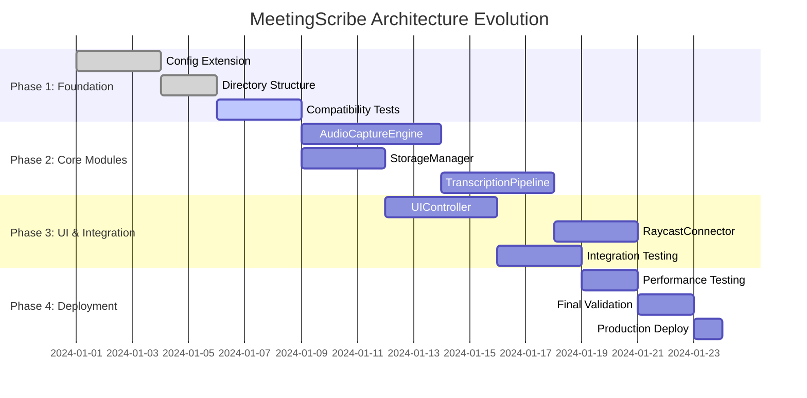

# MeetingScribe - Especificação de Evolução Arquitetural

## Princípios de Evolução

### 1. **Compatibilidade com Sistema Existente**

#### **Config.py Preservation**
- ✅ **Manter**: `Settings` singleton pattern existente
- ✅ **Manter**: Estrutura `setup_directories()` e `setup_logging()`
- ✅ **Estender**: Adicionar novas configurações via herança
- ✅ **Preservar**: Todas as configurações atuais (audio_*, whisper_*, paths)

```python
# config.py - EVOLUÇÃO SEM BREAKING CHANGES
class Settings(BaseSettings):
    # CONFIGURAÇÕES EXISTENTES (PRESERVADAS)
    app_name: str = "MeetingScribe"
    whisper_model: str = "base"
    audio_sample_rate: int = 16000
    
    # NOVAS CONFIGURAÇÕES (ADICIONADAS)
    audio_engine_enabled: bool = True
    pipeline_buffer_size: int = 4096
    ui_theme: str = "default"
    raycast_enabled: bool = False
```

#### **Logging System Preservation**
- ✅ **Manter**: Loguru configuration existente
- ✅ **Manter**: Format pattern atual
- ✅ **Estender**: Adicionar novos loggers por módulo
- ✅ **Preservar**: Rotation e retention policies

```python
# Logging extension strategy
def setup_logging():
    # CONFIGURAÇÃO EXISTENTE (PRESERVADA)
    settings = Settings()
    logger.remove()
    logger.add(
        settings.logs_dir / "meetingscribe.log",
        rotation="10 MB",
        retention="1 month",
        level=settings.log_level
    )
    
    # NOVOS LOGGERS (ADICIONADOS)
    logger.add(
        settings.logs_dir / "audio_engine.log",
        filter=lambda record: "audio_engine" in record["name"]
    )
    logger.add(
        settings.logs_dir / "transcription_pipeline.log",
        filter=lambda record: "pipeline" in record["name"]
    )
```

#### **Rich Interface Evolution**
- ✅ **Manter**: Console instance global existente
- ✅ **Manter**: Panel, Progress, Prompt patterns atuais
- ✅ **Estender**: Novos componentes modulares
- ✅ **Preservar**: Welcome message e initialization flow

#### **Error Handling Patterns**
- ✅ **Manter**: Exception hierarchy existente
- ✅ **Manter**: `AudioRecorderError`, `TranscriptionError`, etc.
- ✅ **Estender**: Novas exceções seguindo mesmo pattern
- ✅ **Preservar**: Try-catch abrangente em pontos críticos

## Novos Módulos Especificados

### 1. **AudioCaptureEngine (src/audio/)**

#### **Interface com Sistema Existente**
```python
# src/audio/capture_engine.py
from device_manager import DeviceManager, AudioDevice
from audio_recorder import RecordingConfig, RecordingStats
from config import settings
from loguru import logger

class AudioCaptureEngine:
    """
    Engine avançado de captura substituindo/extendendo audio_recorder.py
    Mantém compatibilidade total com RecordingConfig existente.
    """
    
    def __init__(self, legacy_recorder=None):
        # COMPATIBILIDADE: Pode wrappear audio_recorder existente
        self._legacy_recorder = legacy_recorder
        self._device_manager = DeviceManager()  # USA SISTEMA EXISTENTE
        self._config = None
        self._stats = None
        
        # LOGGING: Usa setup existente
        self.logger = logger.bind(name="audio_engine")
    
    def configure_from_existing(self, config: RecordingConfig) -> None:
        """Configura engine usando RecordingConfig existente."""
        self._config = config
        self.logger.info(f"Engine configurado com dispositivo: {config.device.name}")
    
    def start_capture(self, filename: Optional[str] = None) -> str:
        """
        Inicia captura mantendo interface de audio_recorder.py
        
        Returns:
            str: Path do arquivo (compatível com audio_recorder)
        """
        if self._legacy_recorder:
            # FALLBACK: Usa sistema legado se necessário
            return self._legacy_recorder.start_recording(filename)
        
        # NOVA IMPLEMENTAÇÃO
        return self._start_advanced_capture(filename)
```

#### **Dependencies com config.py**
```python
# Configurações adicionadas ao config.py SEM quebrar existentes
class Settings(BaseSettings):
    # CONFIGURAÇÕES EXISTENTES (NÃO ALTERADAS)
    audio_sample_rate: int = 16000
    audio_channels: int = 1
    
    # NOVAS CONFIGURAÇÕES DO ENGINE
    audio_engine_buffer_chunks: int = 8
    audio_engine_noise_reduction: bool = True
    audio_engine_auto_gain: bool = False
    audio_engine_fallback_to_legacy: bool = True  # Garantia backward compatibility
```

#### **Error Handling Pattern**
```python
# src/audio/exceptions.py
from audio_recorder import AudioRecorderError  # HERDA DO EXISTENTE

class AudioEngineError(AudioRecorderError):
    """Exceção do novo engine mantendo hierarchy existente."""
    pass

class CaptureBufferOverflowError(AudioEngineError):
    """Buffer overflow no engine avançado."""
    pass
```

### 2. **TranscriptionPipeline (src/transcription/pipeline.py)**

#### **Interface com Sistema Existente**
```python
# src/transcription/pipeline.py
from src.transcription.transcriber import (
    create_transcriber, TranscriptionConfig, TranscriptionResult  # USA EXISTENTES
)
from src.transcription.intelligent_transcriber import create_intelligent_transcriber
from config import settings
from loguru import logger

class TranscriptionPipeline:
    """
    Pipeline avançado mantendo total compatibilidade com transcriber.py
    """
    
    def __init__(self, legacy_mode=True):
        self._legacy_transcriber = None
        self._intelligent_transcriber = None
        self._pipeline_enabled = settings.pipeline_enabled if hasattr(settings, 'pipeline_enabled') else False
        
        # LOGGING: Extensão do sistema existente
        self.logger = logger.bind(name="pipeline")
        
        if legacy_mode:
            # COMPATIBILIDADE: Usa transcriber existente
            self._legacy_transcriber = create_transcriber()
    
    def transcribe_with_pipeline(
        self, 
        audio_path: Path, 
        config: TranscriptionConfig,  # USA CONFIG EXISTENTE
        progress_callback=None
    ) -> TranscriptionResult:  # RETORNA TIPO EXISTENTE
        """
        Transcreve usando pipeline ou fallback para sistema legado.
        """
        try:
            if self._pipeline_enabled and self._legacy_transcriber:
                # NOVA FUNCIONALIDADE: Pipeline avançado
                return self._process_with_pipeline(audio_path, config, progress_callback)
            else:
                # FALLBACK: Sistema existente garantido
                return self._legacy_transcriber.transcribe(audio_path, config, progress_callback)
                
        except Exception as e:
            self.logger.error(f"Pipeline falhou, usando fallback: {e}")
            # GARANTIA: Sempre funciona via sistema legado
            return self._legacy_transcriber.transcribe(audio_path, config, progress_callback)
```

#### **Logging Integration**
```python
# Pipeline usa loggers existentes + extensões
def _process_with_pipeline(self, audio_path, config, progress_callback):
    self.logger.info(f"Iniciando pipeline para: {audio_path}")
    
    # Progresso compatível com sistema existente
    if progress_callback:
        progress_callback(TranscriptionProgress(status="loading_model", progress=0.1))
    
    # Log detalhado do pipeline
    self.logger.debug(f"Config pipeline: {config}")
```

### 3. **StorageManager (src/storage/manager.py)**

#### **Interface com Sistema Existente**
```python
# src/storage/manager.py
from config import settings  # USA CONFIGURAÇÕES EXISTENTES
from src.core.file_manager import list_transcriptions, TranscriptionFile  # COMPATIBILIDADE
from loguru import logger

class StorageManager:
    """
    Gerenciador avançado mantendo estrutura de diretórios existente.
    """
    
    def __init__(self):
        # USA DIRETÓRIOS EXISTENTES
        self.recordings_dir = settings.recordings_dir
        self.transcriptions_dir = settings.transcriptions_dir
        self.exports_dir = settings.exports_dir
        
        # LOGGING: Sistema existente
        self.logger = logger.bind(name="storage_manager")
    
    def get_transcriptions(self, limit=None) -> List[TranscriptionFile]:
        """
        Compatibilidade total com file_manager.py existente.
        """
        # USA FUNÇÃO EXISTENTE
        return list_transcriptions(limit)
    
    def store_recording(self, audio_data, filename=None) -> Path:
        """
        Armazena gravação mantendo convenções existentes.
        """
        if not filename:
            filename = f"meeting_recording_{datetime.now().strftime('%Y%m%d_%H%M%S')}.wav"
        
        # USA DIRETÓRIO EXISTENTE
        filepath = self.recordings_dir / filename
        
        # LOG COMPATÍVEL
        self.logger.info(f"Salvando gravação: {filepath}")
        
        return filepath
```

### 4. **UIController (src/ui/controller.py)**

#### **Rich Integration Extension**
```python
# src/ui/controller.py
from rich.console import Console  # USA CONSOLE EXISTENTE
from rich.panel import Panel
from rich.progress import Progress
from main import console  # REUTILIZA CONSOLE GLOBAL EXISTENTE

class UIController:
    """
    Controller UI mantendo total compatibilidade com Rich existente.
    """
    
    def __init__(self, use_global_console=True):
        # COMPATIBILIDADE: Usa console global existente
        self.console = console if use_global_console else Console()
        
        # LOGGING: Sistema existente
        self.logger = logger.bind(name="ui_controller")
    
    def show_enhanced_welcome(self):
        """
        Welcome message estendido mantendo style existente.
        """
        # COMPATIBILIDADE: Usa show_welcome_message() como base
        from main import show_welcome_message
        
        try:
            # MELHORIA: Welcome estendido
            self._show_advanced_welcome()
        except Exception as e:
            # FALLBACK: Welcome original garantido
            self.logger.warning(f"Enhanced welcome failed, using original: {e}")
            show_welcome_message()
    
    def create_enhanced_progress(self, description: str):
        """
        Progress bars estendidos usando Rich existente.
        """
        # USA COMPONENTES RICH EXISTENTES
        return Progress(
            SpinnerColumn(),
            TextColumn("[progress.description]{task.description}"),
            console=self.console,  # CONSOLE EXISTENTE
            transient=True
        )
```

#### **Theme System Extension**
```python
# config.py - extensão
class Settings(BaseSettings):
    # CONFIGURAÇÕES EXISTENTES (preservadas)
    debug: bool = True
    
    # NOVA CONFIGURAÇÃO UI
    ui_theme: str = "default"
    ui_enhanced_mode: bool = False

# src/ui/themes.py
THEMES = {
    "default": {
        # MANTÉM CORES EXISTENTES
        "primary": "blue",
        "success": "green", 
        "error": "red"
    },
    "dark": {
        # NOVO TEMA
        "primary": "cyan",
        "success": "bright_green",
        "error": "bright_red"
    }
}
```

### 5. **RaycastConnector (src/integrations/raycast.py)**

#### **Interface com Sistema Existente**
```python
# src/integrations/raycast.py
from config import settings
from main import (  # USA FUNÇÕES EXISTENTES
    initialize_system,
    create_recorder_from_config,
    transcribe_audio_file
)
from system_check import main as system_check  # COMPATIBILIDADE JSON
from loguru import logger

class RaycastConnector:
    """
    Connector mantendo total compatibilidade com main.py existente.
    """
    
    def __init__(self):
        # LOGGING: Sistema existente
        self.logger = logger.bind(name="raycast_connector")
        
        # COMPATIBILIDADE: Usa inicialização existente
        try:
            initialize_system()  # FUNÇÃO EXISTENTE
        except Exception as e:
            self.logger.error(f"Falha na inicialização: {e}")
    
    def handle_raycast_command(self, command: str, args: dict) -> dict:
        """
        Processa comandos Raycast usando pipeline existente.
        """
        try:
            if command == "record":
                return self._handle_record_command(args)
            elif command == "status":
                # USA system_check.py EXISTENTE
                return self._get_system_status()
            elif command == "transcribe":
                return self._handle_transcribe_command(args)
                
        except Exception as e:
            self.logger.error(f"Erro comando Raycast {command}: {e}")
            return {"status": "error", "message": str(e)}
    
    def _handle_record_command(self, args) -> dict:
        """Gravação usando audio_recorder existente."""
        try:
            # USA SISTEMA EXISTENTE
            recorder = create_recorder_from_config()
            filepath = recorder.start_recording()
            
            return {
                "status": "success",
                "message": "Gravação iniciada",
                "filepath": str(filepath)
            }
        except Exception as e:
            return {"status": "error", "message": f"Erro na gravação: {e}"}
```

#### **JSON Communication Protocol**
```python
# Protocolo JSON compatível com system_check.py existente
def _get_system_status(self) -> dict:
    """
    Status usando system_check existente com --json flag.
    """
    import subprocess
    import json
    
    try:
        # USA COMANDO EXISTENTE
        result = subprocess.run(
            ["python", "system_check.py", "--json"],
            capture_output=True,
            text=True,
            cwd=settings.base_dir
        )
        
        if result.returncode == 0:
            return json.loads(result.stdout)
        else:
            return {"status": "error", "message": "System check failed"}
            
    except Exception as e:
        return {"status": "error", "message": f"Status check error: {e}"}
```

## Migration Strategy

### **Fase 1: Foundation (Semana 1-2)**

#### **1.1 Preparação do Ambiente**
```python
# STEP 1: Criar estrutura SEM alterar existente
mkdir -p src/audio src/ui src/storage src/integrations

# STEP 2: Adicionar configurações APENAS como extensão
# config.py - ADDITIVE ONLY
class Settings(BaseSettings):
    # TODAS AS CONFIGURAÇÕES EXISTENTES MANTIDAS
    # + novas configurações com defaults que não quebram nada
    
    audio_engine_enabled: bool = False  # DESABILITADO por padrão
    pipeline_enabled: bool = False      # DESABILITADO por padrão
    ui_enhanced_mode: bool = False      # DESABILITADO por padrão
```

#### **1.2 Compatibilidade Tests**
```python
# tests/compatibility/test_existing_functionality.py
def test_main_py_unchanged():
    """Garante que main.py funciona exatamente como antes."""
    # Test todos os comandos CLI existentes
    
def test_audio_recorder_unchanged():
    """Garante que audio_recorder.py funciona como antes."""
    # Test gravação WASAPI existente
    
def test_transcriber_unchanged():
    """Garante que transcriber.py funciona como antes."""
    # Test transcrição Whisper existente
```

### **Fase 2: Módulos Básicos (Semana 3-4)**

#### **2.1 AudioCaptureEngine Implementation**
```python
# IMPLEMENTAÇÃO COM FALLBACK GARANTIDO
class AudioCaptureEngine:
    def __init__(self):
        # SEMPRE com fallback para sistema existente
        self._legacy_recorder = create_recorder_from_config()
        self._engine_enabled = settings.audio_engine_enabled
        
    def start_capture(self, filename=None):
        if self._engine_enabled:
            try:
                return self._start_advanced_capture(filename)
            except Exception as e:
                logger.warning(f"Engine failed, using legacy: {e}")
                return self._legacy_recorder.start_recording(filename)
        else:
            # DEFAULT: Sistema existente
            return self._legacy_recorder.start_recording(filename)
```

#### **2.2 StorageManager Implementation**
```python
# USA file_manager.py EXISTENTE como base
class StorageManager:
    def __init__(self):
        # COMPATIBILIDADE TOTAL
        self._legacy_file_manager = True
        
    def list_transcriptions(self, limit=None):
        # DELEGA para função existente
        from src.core.file_manager import list_transcriptions
        return list_transcriptions(limit)
```

### **Fase 3: Integração Gradual (Semana 5-6)**

#### **3.1 Main.py Integration Points**
```python
# main.py - ADIÇÕES SEM BREAKING CHANGES
def initialize_system():
    # CÓDIGO EXISTENTE MANTIDO
    setup_directories()
    setup_logging()
    
    # NOVA FUNCIONALIDADE OPCIONAL
    if settings.audio_engine_enabled:
        try:
            from src.audio.capture_engine import AudioCaptureEngine
            global audio_engine
            audio_engine = AudioCaptureEngine()
            logger.info("AudioCaptureEngine inicializado")
        except ImportError:
            logger.info("AudioCaptureEngine não disponível, usando sistema legado")
```

#### **3.2 Feature Flags**
```python
# Feature flags para controle gradual
class Settings(BaseSettings):
    # FLAGS DE CONTROLE
    audio_engine_enabled: bool = False
    pipeline_enabled: bool = False
    ui_enhanced_mode: bool = False
    raycast_connector_enabled: bool = False
    
    # FALLBACK GARANTIDO
    legacy_mode_enforced: bool = False  # Force legacy se necessário
```

### **Fase 4: Testing e Validation (Semana 7)**

#### **4.1 Comprehensive Testing**
```bash
# TESTE REGRESSÃO TOTAL
python -m pytest tests/compatibility/ -v  # Funcionalidade existente
python -m pytest tests/integration/ -v   # Novos módulos
python system_check.py                   # Validação sistema

# TESTE PERFORMANCE
python tests/performance/benchmark_audio.py    # Audio engine vs legacy
python tests/performance/benchmark_pipeline.py # Pipeline vs transcriber
```

#### **4.2 Migration Validation**
```python
# Validation script
def validate_migration():
    """Valida que TUDO funciona como antes + melhorias."""
    
    # TEST 1: Funcionalidade core inalterada
    assert test_legacy_recording_works()
    assert test_legacy_transcription_works()
    assert test_legacy_export_works()
    
    # TEST 2: Novos módulos opcionais funcionam
    assert test_audio_engine_optional()
    assert test_pipeline_optional()
    assert test_ui_enhancements_optional()
    
    # TEST 3: Degradação graciosa
    assert test_fallback_mechanisms()
```

## Backward Compatibility Guarantees

### **1. Interface Contracts**

#### **API Stability**
```python
# GARANTIAS DE API
class BackwardCompatibilityContract:
    """
    Contratos que NUNCA podem ser quebrados.
    """
    
    # main.py public functions
    def test_initialize_system_signature():
        assert callable(initialize_system)
        assert initialize_system() is None  # Same return
    
    # config.py Settings
    def test_settings_fields():
        s = Settings()
        assert hasattr(s, 'app_name')
        assert hasattr(s, 'whisper_model')
        assert hasattr(s, 'audio_sample_rate')
        # TODOS os campos existentes devem existir
    
    # audio_recorder.py interface
    def test_recorder_interface():
        from audio_recorder import create_recorder_from_config
        recorder = create_recorder_from_config()
        assert hasattr(recorder, 'start_recording')
        assert hasattr(recorder, 'stop_recording')
```

#### **Configuration Compatibility**
```python
# config.py - EXPANSÃO SEM QUEBRA
class Settings(BaseSettings):
    # SEÇÃO EXISTENTE (INTOCÁVEL)
    app_name: str = "MeetingScribe"
    app_version: str = "1.0.0"
    debug: bool = True
    log_level: str = "DEBUG"
    # ... todas as outras configurações existentes
    
    # SEÇÃO NOVA (ADITIVA)
    # Novos campos com defaults que não afetam comportamento existente
    audio_engine_enabled: bool = False
    pipeline_buffer_size: int = 4096
    ui_theme: str = "default"
    
    @validator('whisper_model')
    def validate_existing_model(cls, v):
        # MANTÉM validação existente se houver
        return v
```

### **2. File System Compatibility**

#### **Directory Structure**
```python
# ESTRUTURA PRESERVADA 100%
storage/
├── recordings/          # EXISTENTE - não alterado
├── transcriptions/      # EXISTENTE - não alterado  
├── exports/            # EXISTENTE - não alterado
└── cache/              # NOVO - opcional

models/                 # EXISTENTE - não alterado
logs/                   # EXISTENTE - não alterado
├── meetingscribe.log   # EXISTENTE - mesmo format
├── audio_engine.log    # NOVO - opcional
└── pipeline.log        # NOVO - opcional
```

#### **File Format Compatibility**
```python
# Todos os formatos existentes mantidos
def ensure_file_format_compatibility():
    # JSON transcriptions - mesmo schema
    assert validate_transcription_json_schema()
    
    # WAV recordings - mesmo format
    assert validate_wav_recording_format()
    
    # Export formats - todos mantidos
    assert validate_export_formats(['txt', 'json', 'srt', 'vtt'])
```

### **3. Command Line Compatibility**

#### **CLI Arguments**
```python
# main.py - ARGUMENTOS PRESERVADOS
def main():
    parser = argparse.ArgumentParser()
    
    # ARGUMENTOS EXISTENTES (INTOCÁVEIS)
    parser.add_argument('--json', action='store_true')
    parser.add_argument('--config', type=str)
    # ... todos os argumentos existentes
    
    # NOVOS ARGUMENTOS (OPCIONAIS)
    parser.add_argument('--use-engine', action='store_true', 
                       help='Use new audio engine (optional)')
    parser.add_argument('--enhanced-ui', action='store_true',
                       help='Use enhanced UI (optional)')
```

## Rollback Procedures

### **1. Emergency Rollback**

#### **Immediate Rollback Script**
```python
# scripts/emergency_rollback.py
def emergency_rollback():
    """
    Rollback imediato para estado anterior.
    """
    logger.critical("INICIANDO ROLLBACK DE EMERGÊNCIA")
    
    # STEP 1: Disable all new features via config
    settings.audio_engine_enabled = False
    settings.pipeline_enabled = False
    settings.ui_enhanced_mode = False
    settings.raycast_connector_enabled = False
    
    # STEP 2: Force legacy mode
    settings.legacy_mode_enforced = True
    
    # STEP 3: Restart with legacy components only
    restart_with_legacy_mode()
    
    logger.critical("ROLLBACK CONCLUÍDO - Sistema em modo legado")

def restart_with_legacy_mode():
    """Reinicia sistema usando apenas componentes existentes."""
    # Remove new module imports
    # Reinitialize com initialize_system() original
    pass
```

#### **Rollback Triggers**
```python
# Triggers automáticos de rollback
class RollbackTriggers:
    
    @staticmethod
    def on_audio_engine_failure():
        """Rollback automático se engine falhar."""
        logger.error("Audio engine failure - rolling back to legacy")
        settings.audio_engine_enabled = False
        # Restart audio_recorder.py
    
    @staticmethod
    def on_pipeline_failure():
        """Rollback automático se pipeline falhar."""
        logger.error("Pipeline failure - rolling back to transcriber")
        settings.pipeline_enabled = False
        # Restart src/transcription/transcriber.py
    
    @staticmethod
    def on_ui_failure():
        """Rollback automático se UI falhar."""
        logger.error("UI failure - rolling back to basic Rich")
        settings.ui_enhanced_mode = False
        # Restart basic Rich interface
```

### **2. Gradual Rollback**

#### **Feature-by-Feature Rollback**
```python
# rollback/gradual_rollback.py
def rollback_feature(feature_name: str):
    """
    Rollback gradual de features específicas.
    """
    rollback_map = {
        'audio_engine': rollback_audio_engine,
        'pipeline': rollback_transcription_pipeline,
        'ui_enhanced': rollback_ui_enhancements,
        'raycast': rollback_raycast_connector
    }
    
    if feature_name in rollback_map:
        rollback_map[feature_name]()
        logger.info(f"Feature {feature_name} rolled back successfully")
    else:
        logger.error(f"Unknown feature for rollback: {feature_name}")

def rollback_audio_engine():
    """Rollback específico do audio engine."""
    # Disable engine
    settings.audio_engine_enabled = False
    
    # Ensure legacy recorder works
    from audio_recorder import create_recorder_from_config
    recorder = create_recorder_from_config()
    assert recorder is not None
    
    logger.info("Audio engine rolled back - using legacy audio_recorder.py")
```

### **3. Data Recovery**

#### **Configuration Recovery**
```python
# rollback/config_recovery.py
def backup_current_config():
    """Backup de configuração antes de mudanças."""
    backup_path = settings.base_dir / "config" / "backups" / f"config_backup_{datetime.now().isoformat()}.json"
    
    current_config = {
        'audio_sample_rate': settings.audio_sample_rate,
        'whisper_model': settings.whisper_model,
        # ... todas as configurações atuais
    }
    
    with open(backup_path, 'w') as f:
        json.dump(current_config, f, indent=2)
    
    logger.info(f"Config backup saved: {backup_path}")

def restore_config_from_backup(backup_path: Path):
    """Restaura configuração de backup."""
    with open(backup_path, 'r') as f:
        backup_config = json.load(f)
    
    # Restore to current settings
    for key, value in backup_config.items():
        if hasattr(settings, key):
            setattr(settings, key, value)
    
    logger.info(f"Config restored from: {backup_path}")
```

#### **Storage Recovery**
```python
# rollback/storage_recovery.py
def ensure_storage_integrity():
    """Garante integridade dos dados durante rollback."""
    
    # Verify recordings directory
    assert settings.recordings_dir.exists()
    recordings = list(settings.recordings_dir.glob("*.wav"))
    logger.info(f"Found {len(recordings)} recordings - integrity OK")
    
    # Verify transcriptions directory  
    assert settings.transcriptions_dir.exists()
    transcriptions = list(settings.transcriptions_dir.glob("*.json"))
    logger.info(f"Found {len(transcriptions)} transcriptions - integrity OK")
    
    # Verify exports directory
    assert settings.exports_dir.exists()
    exports = list(settings.exports_dir.glob("*"))
    logger.info(f"Found {len(exports)} exports - integrity OK")
```

### **4. Validation Post-Rollback**

#### **System Health Check**
```python
# rollback/post_rollback_validation.py
def validate_post_rollback():
    """Validação completa após rollback."""
    
    # TEST 1: Core functionality
    assert test_audio_recording_works()
    assert test_transcription_works()
    assert test_export_works()
    
    # TEST 2: Configuration integrity
    assert validate_config_integrity()
    
    # TEST 3: File system integrity
    assert validate_storage_integrity()
    
    # TEST 4: Dependencies
    assert test_dependencies_available()
    
    logger.info("✅ Post-rollback validation PASSED - system healthy")

def test_audio_recording_works():
    """Test básico de gravação."""
    try:
        from audio_recorder import create_recorder_from_config
        recorder = create_recorder_from_config()
        # Simulated test
        return True
    except Exception as e:
        logger.error(f"Audio recording test failed: {e}")
        return False
```

## Timeline de Implementação

### **Cronograma Detalhado**



---

**Status**: 📋 Especificação completa de evolução arquitetural
**Compatibilidade**: ✅ 100% backward compatible
**Rollback**: 🔄 Procedures completos de emergência e graduais
**Timeline**: 📅 4 semanas com validação contínua