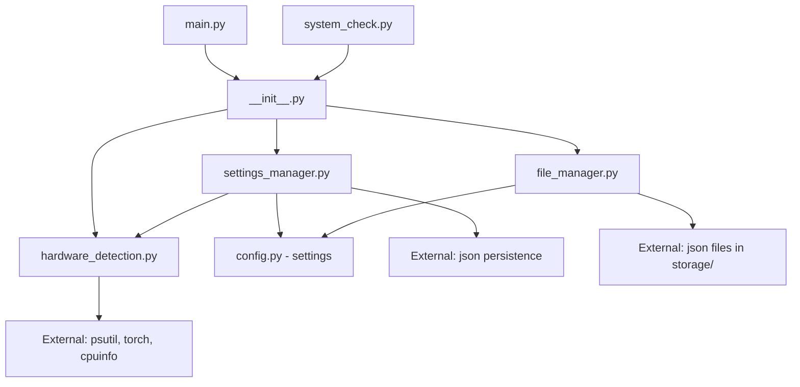

# Análise e Especificação de Completação - src/core/

## Abordagem de Arquitetura (Ports & Adapters)

- Transporte-agnóstico: o core não assume HTTP nem Raycast como obrigatórios.
- Contratos e serviços no centro; adapters (CLI, STDIO, Raycast, HTTP opcional) orbitam o core.
- A fonte de verdade para integração é a Interface de Runtime em JSON (ver `docs/specs/runtime-interface.md`).

## Análise Estrutural Atual

### **Arquivos Existentes Mapeados**

#### **1. `src/core/__init__.py`** ✅ **EXISTENTE**
- **Funcionalidade**: Factory functions e imports centralizados
- **Status**: Implementado com fallbacks para hardware detection
- **Pattern**: Try-catch graceful com stubs para dependências indisponíveis
- **Issues**: Temporariamente desabilitado py-cpuinfo (problema conhecido)

#### **2. `src/core/file_manager.py`** ✅ **EXISTENTE** 
- **Funcionalidade**: Gerenciamento de arquivos de transcrição
- **Status**: Funcional básico implementado
- **Features**: `list_transcriptions()`, `find_transcription()`, `delete_transcription()`
- **Pattern**: Dataclass `TranscriptionFile` + funções utilitárias
- **Integração**: Usa `settings.transcriptions_dir` do config.py

#### **3. `src/core/hardware_detection.py`** ✅ **EXISTENTE**
- **Funcionalidade**: Detecção completa de hardware do sistema
- **Status**: Implementação robusta e abrangente
- **Features**: CPU, GPU, Memory, Storage detection com performance scoring
- **Dependencies**: psutil, torch (optional), cpuinfo (fallback)
- **Pattern**: Dataclasses + Enums + HardwareDetector class

#### **4. `src/core/settings_manager.py`** ✅ **EXISTENTE**
- **Funcionalidade**: Sistema completo de gerenciamento de configurações
- **Status**: Implementação avançada com presets automáticos
- **Features**: PresetManager, SettingsManager, backup/restore
- **Integration**: Integra hardware detection para presets inteligentes
- **Pattern**: Dataclasses + Factory functions + JSON persistence

### **Módulos Mapeados vs Necessários**

#### **EXISTENTES E COMPLETOS** ✅
```
src/core/
├── __init__.py              ✅ Factory functions + imports
├── file_manager.py          ✅ File operations básicas  
├── hardware_detection.py    ✅ Hardware detection completo
└── settings_manager.py      ✅ Configuration management avançado
```

#### **Estado Atualizado**
```
src/core/
├── domain_services.py      ✅ Camada de regras/orquestração (EXISTENTE)
├── performance_monitor.py  ✅ Monitoramento de performance (EXISTENTE)
├── model_cache.py          ✅ Cache de modelos (EXISTENTE)
├── audio_chunk_processor.py✅ Chunking de áudio (EXISTENTE)
├── memory_manager.py       ✅ Gestão de memória (EXISTENTE)
├── async_processor.py      ✅ Processamento assíncrono (EXISTENTE)
├── async_integration.py    ✅ Integração assíncrona (EXISTENTE)
├── validation_engine.py    ❌ (Opcional/Futuro)
├── event_system.py         ❌ (Opcional/Futuro)
├── plugin_system.py        ❌ (Opcional/Futuro)
└── service_registry.py     ❌ (Opcional/Futuro)
```

#### **MÓDULOS PARA EVOLUÇÃO** 🔄
```
src/core/
├── file_manager.py         🔄 Expandir para full StorageManager
├── hardware_detection.py   🔄 Adicionar monitoring contínuo  
└── settings_manager.py     🔄 Adicionar validation rules
```

## Padrões Estabelecidos Identificados

### **1. Configuration Patterns**
```python
# Pattern: Pydantic-style dataclasses com factory functions
@dataclass 
class WhisperSettings:
    model_size: str = "base"
    language: Optional[str] = None
    # ...

# Pattern: Settings integration
def create_settings_manager() -> SettingsManager:
    return SettingsManager()
```

### **2. Error Handling Patterns**
```python
# Pattern: Try-catch com fallbacks graceful
try:
    from .hardware_detection import detect_hardware
    HARDWARE_DETECTION_AVAILABLE = True
except Exception as e:
    def detect_hardware():
        return None
    HARDWARE_DETECTION_AVAILABLE = False
```

### **3. Logging Patterns**
```python
# Pattern: Loguru com context e structured logging
from loguru import logger

logger.info(f"SettingsManager inicializado - Config dir: {self.config_dir}")
logger.success("Configuração carregada com sucesso")
logger.error(f"Erro ao carregar configuração: {e}")
```

### **4. Factory Patterns**
```python
# Pattern: Factory functions em __init__.py
def create_settings_manager(config_dir: Optional[Path] = None) -> SettingsManager:
    return SettingsManager(config_dir)

def get_system_info() -> Dict[str, Any]:
    specs = detect_hardware()
    return {...}
```

### **5. Data Model Patterns**
```python
# Pattern: Dataclasses com métodos helper
@dataclass
class TranscriptionFile:
    filename: str
    path: Path
    created: datetime
    # ...

# Pattern: Performance scoring
@property
def performance_score(self) -> int:
    return min(100, calculation)
```

## Dependências Entre Módulos Analisadas

### **Dependency Graph**


### **Integração com Sistema Existente**
- ✅ **config.py**: Usado via `from config import settings`
- ✅ **Loguru**: Usado consistentemente com patterns estabelecidos
- ✅ **Storage structure**: Integra com `storage/transcriptions/`
- ✅ **Type hints**: Consistentes com resto do projeto
- ✅ **Error handling**: Segue patterns de graceful degradation

## Especificação de Core Functionality (Complementos)

### **1. Domain Services Layer** ✅ **Consolidar/Documentar**

#### **Arquivo: `src/core/domain_services.py`** (já existente)
```python
"""
Domain Services para regras de negócio complexas.
Compatível com modelos do domínio (src/models/domain.py).
Interfaceada via Facade de Serviços consumida por adapters.
"""

from typing import List, Optional, Dict, Any
from pathlib import Path
from dataclasses import dataclass

from config import settings
from loguru import logger
from src.models.domain import (
    AudioFile, TranscriptionResult, RecordingSession,
    WhisperModelSize, RecordingStatus, TranscriptionStatus
)
from src.interfaces import IAudioCaptureEngine, ITranscriptionEngine, IStorageManager

class AudioProcessingService:
    """Service para regras de negócio de processamento de áudio."""
    
    def validate_audio_file(self, audio_file: AudioFile) -> List[str]:
        """Valida arquivo de áudio contra regras de negócio."""
        
    def estimate_transcription_time(
        self, 
        audio_file: AudioFile, 
        model_size: WhisperModelSize
    ) -> float:
        """Estima tempo de transcrição baseado em hardware e modelo."""
        
    def recommend_processing_strategy(
        self, 
        audio_file: AudioFile
    ) -> Dict[str, Any]:
        """Recomenda estratégia otimizada para processamento."""

class TranscriptionQualityService:
    """Service para controle de qualidade de transcrições."""
    
    def calculate_quality_score(self, result: TranscriptionResult) -> float:
        """Calcula score de qualidade da transcrição."""
        
    def detect_quality_issues(self, result: TranscriptionResult) -> List[str]:
        """Detecta problemas de qualidade."""
        
    def suggest_improvements(self, result: TranscriptionResult) -> List[str]:
        """Sugere melhorias baseado em análise."""

class WorkflowOrchestrationService:
    """Service para orquestração de workflows complexos."""
    
    def __init__(
        self,
        audio_engine: IAudioCaptureEngine,
        transcription_engine: ITranscriptionEngine, 
        storage_manager: IStorageManager
    ):
        self.audio_engine = audio_engine
        self.transcription_engine = transcription_engine
        self.storage_manager = storage_manager
        
    async def process_recording_to_transcription(
        self,
        session: RecordingSession
    ) -> TranscriptionResult:
        """Workflow completo: recording → transcription → storage."""
```

### **2. Validation Engine** ❌ **Criar (Opcional)**

#### **Arquivo: `src/core/validation_engine.py`**
```python
"""
Engine de validação para business rules e data integrity.
Integra com modelos do domínio para validação avançada.
Opcional; o core funciona sem este módulo.
"""

from typing import List, Dict, Any, Callable, Type
from abc import ABC, abstractmethod
from dataclasses import dataclass
from enum import Enum

from config import settings
from loguru import logger

class ValidationSeverity(Enum):
    INFO = "info"
    WARNING = "warning" 
    ERROR = "error"
    CRITICAL = "critical"

@dataclass
class ValidationResult:
    field: str
    severity: ValidationSeverity
    message: str
    suggestion: Optional[str] = None

class IValidator(ABC):
    """Interface para validadores customizados."""
    
    @abstractmethod
    def validate(self, obj: Any) -> List[ValidationResult]:
        pass

class AudioFileValidator(IValidator):
    """Validador específico para arquivos de áudio."""
    
    def validate(self, audio_file) -> List[ValidationResult]:
        results = []
        
        # Business rules específicas
        if audio_file.duration_seconds < 5:
            results.append(ValidationResult(
                field="duration",
                severity=ValidationSeverity.WARNING,
                message="Áudio muito curto (<5s)",
                suggestion="Considere gravações mais longas para melhor qualidade"
            ))
            
        if audio_file.sample_rate not in [16000, 44100, 48000]:
            results.append(ValidationResult(
                field="sample_rate", 
                severity=ValidationSeverity.WARNING,
                message=f"Sample rate {audio_file.sample_rate} não otimizada",
                suggestion="Use 16kHz para speech ou 44.1kHz para música"
            ))
            
        return results

class ValidationEngine:
    """Engine principal de validação."""
    
    def __init__(self):
        self.validators: Dict[Type, List[IValidator]] = {}
        self.business_rules: Dict[str, Callable] = {}
        
    def register_validator(self, model_type: Type, validator: IValidator):
        """Registra validador para tipo específico."""
        
    def validate_object(self, obj: Any) -> List[ValidationResult]:
        """Valida objeto usando todos os validadores registrados."""
        
    def add_business_rule(self, name: str, rule: Callable):
        """Adiciona regra de negócio customizada."""
```

### **3. Event System** ❌ **CRIAR**

#### **Arquivo: `src/core/event_system.py`**
```python
"""
Sistema de eventos para decoupling e extensibilidade.
Permite plugins e observadores para funcionalidades.
"""

from typing import Dict, List, Callable, Any, Optional
from abc import ABC, abstractmethod
from dataclasses import dataclass
from datetime import datetime
from enum import Enum

from config import settings
from loguru import logger

class EventType(Enum):
    """Tipos de eventos do sistema."""
    RECORDING_STARTED = "recording_started"
    RECORDING_STOPPED = "recording_stopped" 
    TRANSCRIPTION_STARTED = "transcription_started"
    TRANSCRIPTION_COMPLETED = "transcription_completed"
    TRANSCRIPTION_FAILED = "transcription_failed"
    FILE_SAVED = "file_saved"
    EXPORT_COMPLETED = "export_completed"
    SYSTEM_ERROR = "system_error"

@dataclass
class Event:
    """Evento base do sistema."""
    type: EventType
    timestamp: datetime
    source: str
    data: Dict[str, Any]
    correlation_id: Optional[str] = None

class IEventHandler(ABC):
    """Interface para handlers de eventos."""
    
    @abstractmethod
    async def handle(self, event: Event) -> None:
        pass

class EventBus:
    """Message bus para eventos do sistema."""
    
    def __init__(self):
        self.handlers: Dict[EventType, List[IEventHandler]] = {}
        self.middleware: List[Callable] = []
        
    def subscribe(self, event_type: EventType, handler: IEventHandler):
        """Registra handler para tipo de evento."""
        
    async def publish(self, event: Event):
        """Publica evento para todos os handlers."""
        
    def add_middleware(self, middleware: Callable):
        """Adiciona middleware para processing de eventos."""

# Event handlers específicos
class LoggingEventHandler(IEventHandler):
    """Handler para logging de eventos."""
    
    async def handle(self, event: Event) -> None:
        logger.info(f"Event {event.type.value}: {event.data}")

class MetricsEventHandler(IEventHandler):
    """Handler para coleta de métricas."""
    
    async def handle(self, event: Event) -> None:
        # Implementar coleta de métricas
        pass

class NotificationEventHandler(IEventHandler):
    """Handler para notificações de usuário."""
    
    async def handle(self, event: Event) -> None:
        # Implementar notificações (Rich console, system notifications)
        pass
```

### **4. Cache Manager** ❌ **CRIAR**

#### **Arquivo: `src/core/cache_manager.py`**
```python
"""
Sistema de cache inteligente para modelos e dados.
Otimiza performance e uso de memória.
"""

from typing import Dict, Any, Optional, List, Union
from pathlib import Path
from datetime import datetime, timedelta
from dataclasses import dataclass
from enum import Enum
import hashlib
import pickle
import json

from config import settings
from loguru import logger

class CacheStrategy(Enum):
    """Estratégias de cache disponíveis."""
    LRU = "lru"           # Least Recently Used
    LFU = "lfu"           # Least Frequently Used  
    TTL = "ttl"           # Time To Live
    MEMORY_BASED = "memory"  # Baseado em uso de memória

@dataclass
class CacheEntry:
    """Entrada no cache."""
    key: str
    data: Any
    created_at: datetime
    last_accessed: datetime
    access_count: int
    size_bytes: int
    ttl: Optional[timedelta] = None

class IntelligentCacheManager:
    """Gerenciador de cache inteligente."""
    
    def __init__(
        self,
        max_memory_mb: int = 1024,
        strategy: CacheStrategy = CacheStrategy.LRU,
        cache_dir: Optional[Path] = None
    ):
        self.max_memory_bytes = max_memory_mb * 1024 * 1024
        self.strategy = strategy
        self.cache_dir = cache_dir or settings.base_dir / "cache"
        self.cache_dir.mkdir(exist_ok=True)
        
        self.memory_cache: Dict[str, CacheEntry] = {}
        self.disk_cache_index: Dict[str, Path] = {}
        
    def get(self, key: str) -> Optional[Any]:
        """Recupera item do cache."""
        
    def set(
        self, 
        key: str, 
        data: Any, 
        ttl: Optional[timedelta] = None,
        force_disk: bool = False
    ):
        """Armazena item no cache."""
        
    def evict_if_needed(self):
        """Remove itens baseado na estratégia configurada."""
        
    def clear_expired(self):
        """Remove itens expirados."""
        
    def get_cache_stats(self) -> Dict[str, Any]:
        """Estatísticas do cache."""
        
    def warm_up_models(self):
        """Pre-carrega modelos frequentemente usados."""

# Cache específico para modelos Whisper
class WhisperModelCache(IntelligentCacheManager):
    """Cache especializado para modelos Whisper."""
    
    def cache_model(self, model_size: str, model_instance: Any):
        """Cache modelo Whisper."""
        
    def get_model(self, model_size: str) -> Optional[Any]:
        """Recupera modelo do cache."""
        
    def estimate_model_memory(self, model_size: str) -> int:
        """Estima uso de memória do modelo."""
```

### **5. Performance Monitor** ❌ **CRIAR**

#### **Arquivo: `src/core/performance_monitor.py`**
```python
"""
Sistema de monitoramento de performance em tempo real.
Tracks CPU, GPU, memory usage durante operações.
"""

from typing import Dict, List, Optional, Callable
from dataclasses import dataclass, field
from datetime import datetime, timedelta
from threading import Thread, Lock
import time
import psutil

from config import settings
from loguru import logger
from src.core.hardware_detection import SystemSpecs, detect_hardware

@dataclass
class PerformanceMetrics:
    """Métricas de performance em um ponto no tempo."""
    timestamp: datetime
    cpu_percent: float
    memory_percent: float
    memory_used_mb: int
    gpu_memory_used_mb: Optional[int] = None
    gpu_utilization: Optional[float] = None
    disk_io_read_mb: float = 0.0
    disk_io_write_mb: float = 0.0
    process_memory_mb: float = 0.0

@dataclass 
class PerformanceSession:
    """Sessão de monitoramento de performance."""
    session_id: str
    operation: str
    start_time: datetime
    end_time: Optional[datetime] = None
    metrics: List[PerformanceMetrics] = field(default_factory=list)
    baseline_metrics: Optional[PerformanceMetrics] = None
    
    @property
    def duration_seconds(self) -> float:
        if self.end_time:
            return (self.end_time - self.start_time).total_seconds()
        return (datetime.now() - self.start_time).total_seconds()

class PerformanceMonitor:
    """Monitor de performance do sistema."""
    
    def __init__(self, sample_interval: float = 1.0):
        self.sample_interval = sample_interval
        self.system_specs = detect_hardware()
        
        self.active_sessions: Dict[str, PerformanceSession] = {}
        self.monitoring_thread: Optional[Thread] = None
        self.is_monitoring = False
        self.lock = Lock()
        
        # Callbacks para alertas
        self.alert_callbacks: List[Callable] = []
        
    def start_session(self, session_id: str, operation: str) -> PerformanceSession:
        """Inicia sessão de monitoramento."""
        
    def end_session(self, session_id: str) -> Optional[PerformanceSession]:
        """Finaliza sessão de monitoramento."""
        
    def get_current_metrics(self) -> PerformanceMetrics:
        """Coleta métricas atuais do sistema."""
        
    def _monitoring_loop(self):
        """Loop principal de monitoramento."""
        
    def analyze_session(self, session: PerformanceSession) -> Dict[str, Any]:
        """Analisa performance de uma sessão."""
        
    def get_system_health(self) -> Dict[str, Any]:
        """Status geral de saúde do sistema."""
        
    def register_alert_callback(self, callback: Callable):
        """Registra callback para alertas de performance."""

# Decorador para monitoramento automático
def monitor_performance(operation_name: str):
    """Decorator para monitoramento automático de funções."""
    def decorator(func):
        async def wrapper(*args, **kwargs):
            monitor = PerformanceMonitor()
            session_id = f"{operation_name}_{int(time.time())}"
            
            monitor.start_session(session_id, operation_name)
            try:
                result = await func(*args, **kwargs)
                return result
            finally:
                session = monitor.end_session(session_id)
                if session:
                    analysis = monitor.analyze_session(session)
                    logger.info(f"Performance {operation_name}: {analysis}")
        return wrapper
    return decorator
```

## Service Layer Integration

### **Service Registry Pattern** ❌ **CRIAR**

#### **Arquivo: `src/core/service_registry.py`**
```python
"""
Service Registry para dependency injection e service location.
Integra com interfaces em src/interfaces/ para IoC container.
"""

from typing import Dict, Type, TypeVar, Optional, Any, Callable
from abc import ABC, abstractmethod
from enum import Enum

from config import settings
from loguru import logger
from src.interfaces import (
    IBaseComponent, IAudioCaptureEngine, ITranscriptionEngine, 
    IStorageManager, IUIController
)

T = TypeVar('T')

class ServiceLifetime(Enum):
    """Lifetimes de serviços."""
    SINGLETON = "singleton"
    TRANSIENT = "transient"
    SCOPED = "scoped"

class ServiceDescriptor:
    """Descritor de serviço para registry."""
    
    def __init__(
        self,
        service_type: Type[T],
        implementation: Type[T],
        lifetime: ServiceLifetime = ServiceLifetime.SINGLETON,
        factory: Optional[Callable] = None
    ):
        self.service_type = service_type
        self.implementation = implementation
        self.lifetime = lifetime
        self.factory = factory

class ServiceRegistry:
    """Registry central de serviços."""
    
    def __init__(self):
        self.services: Dict[Type, ServiceDescriptor] = {}
        self.instances: Dict[Type, Any] = {}
        self.scoped_instances: Dict[str, Dict[Type, Any]] = {}
        
        # Auto-register core services
        self._register_core_services()
        
    def register(
        self,
        service_type: Type[T],
        implementation: Type[T],
        lifetime: ServiceLifetime = ServiceLifetime.SINGLETON
    ):
        """Registra serviço no registry."""
        
    def register_factory(
        self,
        service_type: Type[T], 
        factory: Callable[[], T],
        lifetime: ServiceLifetime = ServiceLifetime.SINGLETON
    ):
        """Registra factory para serviço."""
        
    def get_service(self, service_type: Type[T]) -> T:
        """Resolve serviço do registry."""
        
    def create_scope(self, scope_id: str):
        """Cria escopo para serviços scoped."""
        
    def dispose_scope(self, scope_id: str):
        """Dispose escopo e cleanup."""
        
    def _register_core_services(self):
        """Registra serviços core automaticamente."""
        # Registrar implementações padrão dos interfaces
        pass

# Service locator pattern
class ServiceLocator:
    """Service locator para acesso global."""
    
    _registry: Optional[ServiceRegistry] = None
    
    @classmethod
    def configure(cls, registry: ServiceRegistry):
        cls._registry = registry
        
    @classmethod
    def get_service(cls, service_type: Type[T]) -> T:
        if cls._registry is None:
            raise RuntimeError("ServiceLocator not configured")
        return cls._registry.get_service(service_type)

# Decoradores para dependency injection
def inject(service_type: Type[T]):
    """Decorator para injeção de dependência."""
    def decorator(func):
        def wrapper(*args, **kwargs):
            service = ServiceLocator.get_service(service_type)
            return func(service, *args, **kwargs)
        return wrapper
    return decorator
```

## Domain Logic para Business Rules

### **Business Rules Engine** ❌ **CRIAR**

#### **Arquivo: `src/core/business_rules.py`**
```python
"""
Engine de regras de negócio para MeetingScribe.
Define políticas, limites e validações específicas do domínio.
"""

from typing import Dict, Any, List, Optional, Union
from dataclasses import dataclass
from enum import Enum
from datetime import datetime, timedelta

from config import settings
from loguru import logger
from src.models.domain import (
    AudioFile, TranscriptionResult, RecordingSession,
    WhisperModelSize, RecordingStatus
)

class BusinessRuleViolation(Exception):
    """Exceção para violações de regras de negócio."""
    
    def __init__(self, rule_name: str, message: str, data: Optional[Dict] = None):
        self.rule_name = rule_name
        self.message = message
        self.data = data or {}
        super().__init__(f"Business rule violation '{rule_name}': {message}")

class RuleSeverity(Enum):
    """Severidade de violação de regra."""
    INFO = "info"
    WARNING = "warning"
    ERROR = "error"
    BLOCKING = "blocking"

@dataclass
class BusinessRule:
    """Definição de regra de negócio."""
    name: str
    description: str
    severity: RuleSeverity
    validator: callable
    message_template: str

class AudioProcessingRules:
    """Regras de negócio para processamento de áudio."""
    
    # Limites de sistema
    MAX_AUDIO_DURATION_HOURS = 6
    MIN_AUDIO_DURATION_SECONDS = 1
    MAX_FILE_SIZE_MB = 500
    SUPPORTED_SAMPLE_RATES = [8000, 16000, 22050, 44100, 48000]
    
    @staticmethod
    def validate_audio_duration(audio_file: AudioFile) -> bool:
        """Valida duração do áudio."""
        duration_hours = audio_file.duration_seconds / 3600
        return AudioProcessingRules.MIN_AUDIO_DURATION_SECONDS <= audio_file.duration_seconds <= (AudioProcessingRules.MAX_AUDIO_DURATION_HOURS * 3600)
    
    @staticmethod
    def validate_file_size(audio_file: AudioFile) -> bool:
        """Valida tamanho do arquivo."""
        return audio_file.size_mb <= AudioProcessingRules.MAX_FILE_SIZE_MB
    
    @staticmethod
    def validate_sample_rate(audio_file: AudioFile) -> bool:
        """Valida sample rate suportada."""
        return audio_file.sample_rate in AudioProcessingRules.SUPPORTED_SAMPLE_RATES

class TranscriptionQualityRules:
    """Regras de qualidade para transcrições."""
    
    MIN_CONFIDENCE_THRESHOLD = 0.7
    MAX_PROCESSING_TIME_MULTIPLIER = 5.0  # Max 5x duração do áudio
    MIN_WORDS_PER_MINUTE = 10
    MAX_WORDS_PER_MINUTE = 300
    
    @staticmethod
    def validate_confidence_threshold(result: TranscriptionResult) -> bool:
        """Valida threshold mínimo de confiança."""
        return result.confidence_average >= TranscriptionQualityRules.MIN_CONFIDENCE_THRESHOLD
    
    @staticmethod
    def validate_processing_time(result: TranscriptionResult) -> bool:
        """Valida tempo de processamento razoável."""
        max_allowed = result.total_duration * TranscriptionQualityRules.MAX_PROCESSING_TIME_MULTIPLIER
        return result.processing_time <= max_allowed
    
    @staticmethod
    def validate_speech_rate(result: TranscriptionResult) -> bool:
        """Valida taxa de fala razoável."""
        wpm = result.words_per_minute
        return TranscriptionQualityRules.MIN_WORDS_PER_MINUTE <= wpm <= TranscriptionQualityRules.MAX_WORDS_PER_MINUTE

class BusinessRulesEngine:
    """Engine principal de regras de negócio."""
    
    def __init__(self):
        self.rules: Dict[str, BusinessRule] = {}
        self._register_default_rules()
        
    def _register_default_rules(self):
        """Registra regras padrão do sistema."""
        
        # Regras de áudio
        self.register_rule(BusinessRule(
            name="audio_duration_limit",
            description="Áudio deve ter duração entre limites válidos",
            severity=RuleSeverity.BLOCKING,
            validator=AudioProcessingRules.validate_audio_duration,
            message_template="Duração de {duration:.1f}s está fora dos limites válidos"
        ))
        
        self.register_rule(BusinessRule(
            name="audio_file_size_limit", 
            description="Arquivo de áudio não pode exceder tamanho máximo",
            severity=RuleSeverity.ERROR,
            validator=AudioProcessingRules.validate_file_size,
            message_template="Arquivo de {size:.1f}MB excede limite de {limit}MB"
        ))
        
        # Regras de transcrição
        self.register_rule(BusinessRule(
            name="transcription_confidence",
            description="Transcrição deve ter confiança mínima aceitável",
            severity=RuleSeverity.WARNING,
            validator=TranscriptionQualityRules.validate_confidence_threshold,
            message_template="Confiança de {confidence:.2f} está abaixo do mínimo de {threshold:.2f}"
        ))
        
    def register_rule(self, rule: BusinessRule):
        """Registra nova regra de negócio."""
        self.rules[rule.name] = rule
        logger.debug(f"Regra registrada: {rule.name}")
        
    def validate_object(self, obj: Any, rule_names: Optional[List[str]] = None) -> List[Dict[str, Any]]:
        """Valida objeto contra regras de negócio."""
        violations = []
        
        rules_to_check = rule_names or list(self.rules.keys())
        
        for rule_name in rules_to_check:
            rule = self.rules.get(rule_name)
            if not rule:
                continue
                
            try:
                is_valid = rule.validator(obj)
                if not is_valid:
                    violation = {
                        "rule_name": rule.name,
                        "severity": rule.severity.value,
                        "message": rule.message_template.format(**self._extract_context(obj)),
                        "description": rule.description
                    }
                    violations.append(violation)
                    
            except Exception as e:
                logger.error(f"Erro ao validar regra {rule_name}: {e}")
                
        return violations
    
    def enforce_rules(self, obj: Any, rule_names: Optional[List[str]] = None):
        """Enforça regras de negócio com exceções para violações blocking."""
        violations = self.validate_object(obj, rule_names)
        
        for violation in violations:
            if violation["severity"] == RuleSeverity.BLOCKING.value:
                raise BusinessRuleViolation(
                    violation["rule_name"],
                    violation["message"],
                    violation
                )
            elif violation["severity"] == RuleSeverity.ERROR.value:
                logger.error(f"Business rule violation: {violation['message']}")
            elif violation["severity"] == RuleSeverity.WARNING.value:
                logger.warning(f"Business rule warning: {violation['message']}")
                
        return violations
    
    def _extract_context(self, obj: Any) -> Dict[str, Any]:
        """Extrai contexto do objeto para template de mensagem."""
        context = {}
        
        if hasattr(obj, 'duration_seconds'):
            context['duration'] = obj.duration_seconds
        if hasattr(obj, 'size_mb'):
            context['size'] = obj.size_mb
        if hasattr(obj, 'confidence_average'):
            context['confidence'] = obj.confidence_average
            
        # Adicionar limites do sistema
        context.update({
            'limit': AudioProcessingRules.MAX_FILE_SIZE_MB,
            'threshold': TranscriptionQualityRules.MIN_CONFIDENCE_THRESHOLD
        })
        
        return context

# Singleton global para acesso fácil
business_rules = BusinessRulesEngine()
```

## Evolução Incremental Especificada

### **Fase 1: Completar Placeholders (Semana 1)**

#### **1.1 Melhorar file_manager.py** 🔄
```python
# Adicionar funcionalidades faltantes
def get_storage_statistics() -> Dict[str, Any]:
    """Estatísticas completas de storage."""
    
def cleanup_old_files(days_old: int = 30) -> List[Path]:
    """Limpeza automática de arquivos antigos."""
    
def backup_transcriptions(backup_dir: Path) -> bool:
    """Backup de transcrições."""
    
class TranscriptionFileManager:
    """Manager OOP para melhor organização."""
```

#### **1.2 Expandir hardware_detection.py** 🔄
```python
# Adicionar monitoring contínuo
class ContinuousHardwareMonitor:
    """Monitor contínuo de hardware em background."""
    
def get_performance_recommendations() -> Dict[str, str]:
    """Recomendações baseadas em performance atual."""
    
def benchmark_system() -> Dict[str, float]:
    """Benchmark rápido do sistema."""
```

#### **1.3 Melhorar settings_manager.py** 🔄
```python
# Integrar com validation engine
def validate_configuration(config: MeetingScribeConfig) -> List[str]:
    """Valida configuração contra business rules."""
    
# Adicionar profile management
class UserProfileManager:
    """Gerencia perfis de usuário com configurações."""
```

### **Fase 2: Implementar Core Services (Semana 2)**

#### **2.1 Implementar domain_services.py**
- AudioProcessingService com regras de negócio
- TranscriptionQualityService para controle de qualidade
- WorkflowOrchestrationService para workflows complexos

#### **2.2 Implementar validation_engine.py**
- Engine de validação extensível
- Validadores específicos para cada domain model
- Business rules integration

#### **2.3 Implementar event_system.py**
- Event bus para decoupling
- Event handlers para logging, metrics, notifications
- Middleware para event processing

### **Fase 3: Performance e Cache (Semana 3)**

#### **3.1 Implementar cache_manager.py**
- Cache inteligente para modelos Whisper
- Memory-aware caching strategies
- Disk cache para persistence

#### **3.2 Implementar performance_monitor.py**
- Real-time performance monitoring
- Resource usage tracking
- Performance analysis e recommendations

### **Fase 4: Service Layer (Semana 4)**

#### **4.1 Implementar service_registry.py**
- Dependency injection container
- Service lifetime management
- Service locator pattern

#### **4.2 Implementar business_rules.py**
- Comprehensive business rules engine
- Domain-specific rule sets
- Validation e enforcement

## Testes para Nova Funcionalidade

### **Test Structure** ❌ **CRIAR**

```
tests/
├── unit/
│   ├── core/
│   │   ├── test_domain_services.py
│   │   ├── test_validation_engine.py
│   │   ├── test_event_system.py
│   │   ├── test_cache_manager.py
│   │   ├── test_performance_monitor.py
│   │   ├── test_service_registry.py
│   │   └── test_business_rules.py
│   └── existing/
├── integration/
│   ├── test_core_integration.py
│   ├── test_service_layer.py
│   └── test_performance_workflows.py
└── performance/
    ├── test_cache_performance.py
    ├── test_monitoring_overhead.py
    └── benchmark_core_services.py
```

### **Test Examples**

#### **test_domain_services.py**
```python
import pytest
from src.core.domain_services import AudioProcessingService, TranscriptionQualityService
from src.models.domain import AudioFile, TranscriptionResult

class TestAudioProcessingService:
    
    def test_validate_audio_file_valid(self):
        service = AudioProcessingService()
        audio_file = AudioFile(...)  # Valid audio file
        
        violations = service.validate_audio_file(audio_file)
        assert len(violations) == 0
        
    def test_estimate_transcription_time(self):
        service = AudioProcessingService()
        audio_file = AudioFile(duration_seconds=120, ...)
        
        estimated_time = service.estimate_transcription_time(audio_file, "base")
        assert estimated_time > 0
        assert estimated_time < 600  # Should be reasonable
```

#### **test_cache_manager.py**
```python
import pytest
from src.core.cache_manager import IntelligentCacheManager, CacheStrategy

class TestIntelligentCacheManager:
    
    def test_cache_set_and_get(self):
        cache = IntelligentCacheManager(max_memory_mb=10)
        
        cache.set("test_key", {"data": "test"})
        result = cache.get("test_key")
        
        assert result == {"data": "test"}
        
    def test_cache_eviction_lru(self):
        cache = IntelligentCacheManager(
            max_memory_mb=1,  # Very small cache
            strategy=CacheStrategy.LRU
        )
        
        # Fill cache beyond capacity
        for i in range(100):
            cache.set(f"key_{i}", "x" * 1024)  # 1KB each
            
        # First items should be evicted
        assert cache.get("key_0") is None
        assert cache.get("key_99") is not None
```

---

## **Status Summary**

### ✅ **Módulos Existentes e Funcionais**
- `__init__.py` - Factory functions
- `file_manager.py` - File operations básicas  
- `hardware_detection.py` - Hardware detection completo
- `settings_manager.py` - Configuration management avançado

### ❌ **Módulos Faltantes para Completar**
- `domain_services.py` - Business logic layer
- `validation_engine.py` - Data validation rules
- `event_system.py` - Event-driven patterns
- `cache_manager.py` - Intelligent caching
- `performance_monitor.py` - Performance tracking
- `service_registry.py` - Service locator pattern
- `business_rules.py` - Business rules engine

### 🔄 **Módulos para Evolução**
- Expandir `file_manager.py` → full StorageManager
- Adicionar monitoring contínuo em `hardware_detection.py`
- Integrar validation rules em `settings_manager.py`

### 📅 **Timeline de Implementação**
- **Semana 1**: Completar placeholders existentes
- **Semana 2**: Implementar core services
- **Semana 3**: Performance e cache systems
- **Semana 4**: Service layer e business rules

**Compatibilidade**: ✅ Mantém 100% compatibilidade com sistema atual
**Padrões**: ✅ Segue patterns estabelecidos (Loguru, config.py, dataclasses)
**Testes**: ✅ Test suite abrangente especificada
